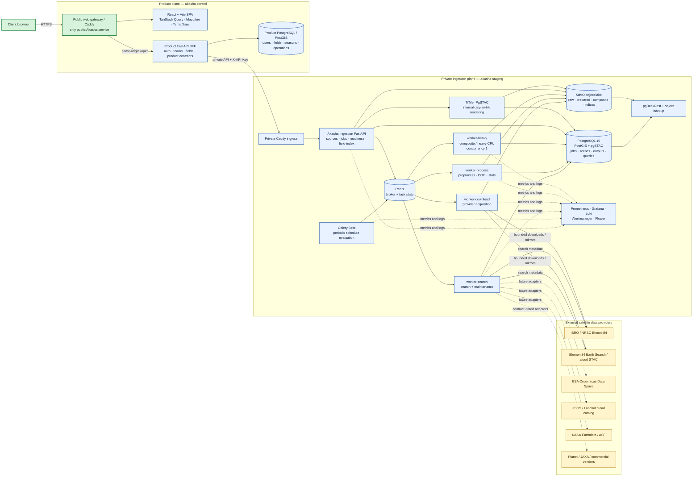
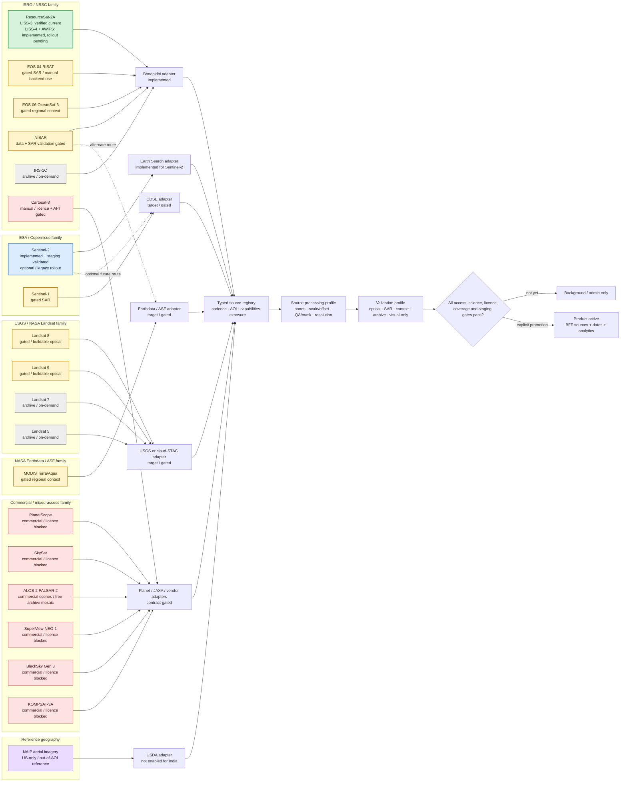
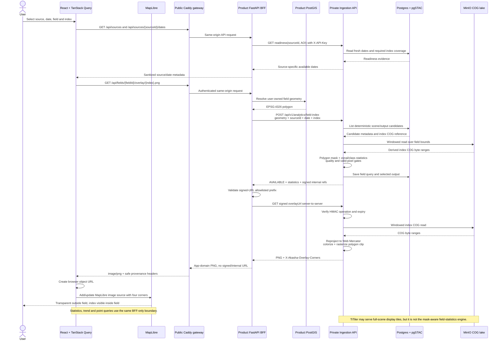

# Akasha End-to-End Satellite Architecture

## Purpose

This document explains how Akasha discovers new satellite data, safely ingests it, converts it into
analysis-ready Cloud Optimized GeoTIFFs (COGs), applies quality masks, calculates vegetation
indices, catalogs the results, and serves field analytics to the web application.

It is intentionally both **client-readable** and **implementation-grounded**. The diagrams show:

1. the deployed system and security boundaries;
2. how all 20 catalog platforms fit into the reusable onboarding architecture;
3. the automatic ingestion and raster-processing workflow; and
4. how a field request becomes statistics and a clipped MapLibre overlay.

The most important distinction is that **architecture readiness is not the same as source
readiness**. Akasha has a reusable integration model for every catalog platform, but a source is not
made operational until its provider access, processing profile, scientific validation, licensing,
coverage, and staging acceptance gates pass.

## Executive explanation

Akasha has two cooperating applications:

- **Akasha Ingestion** owns provider access, automatic scheduling, raw/source retention, raster
  processing, COG creation, PostGIS/pgSTAC cataloging, MinIO storage, readiness, and signed field
  analytics.
- **The Akasha product application** owns users, teams, fields, seasons, product APIs, same-origin
  security, and the React/MapLibre user experience.

In plain language, the complete flow is:

1. Register a satellite product and its provider route.
2. Periodically ask whether that source is due for a refresh.
3. Search the provider for acquisitions covering the configured area and date window.
4. Download or mirror only bounded, eligible products and verify their integrity.
5. Standardize provider-specific data into an analytic COG and a separate quality-mask COG.
6. Align scenes and build a validated area-of-interest composite when the source requires one.
7. Convert digital numbers to reflectance, apply the quality mask, and calculate only scientifically
   supported indices.
8. Store derived COGs in MinIO and metadata in PostGIS/pgSTAC.
9. When a user selects a field, choose the best valid acquisition and compute field-level results.
10. Return sanitized statistics or a field-clipped PNG through the product application; the browser
    never sees provider, storage, catalog, or signed ingestion internals.

## Status legend

| Status                                   | Meaning                                                                                                                                |
| ---------------------------------------- | -------------------------------------------------------------------------------------------------------------------------------------- |
| **Verified current**               | The end-to-end standalone-ingestion and product-BFF path has live staging evidence.                                                    |
| **Implemented, rollout pending**   | Core code exists and is tested, but source-specific live acceptance, freshness, or product cutover is still required.                  |
| **Gated / buildable**              | The reusable architecture applies, but a provider adapter, processing profile, validation evidence, or explicit rollout is incomplete. |
| **Archive / on-demand**            | Historical data only; never a routine current-monitoring schedule.                                                                     |
| **Commercial / licensing blocked** | Technical onboarding is possible only after contract, quota, and paid-order appro val.                                                 |
| **Reference / out-of-AOI**         | Documented for methodology or another geography, but not an active India/Bangalore source.                                             |

### Current verified position

As of **2026-07-10**:

- ResourceSat-2A **LISS-3** has a verified standalone-ingestion pipeline and product-BFF cutover.
- **Sentinel-2** has an implemented and staging-validated standalone ingestion bridge, but remains
  optional/legacy rather than the default production-selectable source.
- ResourceSat-2A **LISS-4** and **AWiFS** have standalone processing, scheduler, readiness, and
  analytics support in code; they still require their own recorded live acceptance and product
  cutover.
- The remaining catalog platforms are explicitly gated, archive-only, commercial-blocked, or
  reference-only. They are included below as the target integration architecture, not represented
  as already operational.

---

## 1. System context and deployment architecture

### How to read this diagram

The left side is the external data-supply world. The middle is the **private ingestion plane** on
the provider-approved staging host. The right side is the **public product plane**. The only browser
entry point is the product `web` gateway. The product BFF communicates with ingestion over a private
server-to-server route.

### Architectural boundaries

- **One public service:** only the product `web` gateway receives browser traffic.
- **Private ingestion:** the ingestion API, Redis, workers, Postgres/pgSTAC, MinIO, and TiTiler do
  not receive browser traffic or public product domains.
- **Provider isolation:** provider credentials and downloads remain on the approved ingestion host.
  Bulk raster data stays under the ingestion data root on the staging data disk.
- **BFF isolation:** the product BFF is the only supported consumer of ingestion field analytics.
  It translates ingestion contracts into product contracts and strips internal details.
- **Portable containers:** the same pinned container topology can run through Docker Compose on
  Azure staging or customer-controlled/on-premises Linux infrastructure.

### Component responsibilities

| Component              | Main responsibility                                                                                        |     Public? | Authoritative data                                      |
| ---------------------- | ---------------------------------------------------------------------------------------------------------- | ----------: | ------------------------------------------------------- |
| Source registry        | Source/product state, provider route, cadence, bands, supported indices, exposure gates                    |          No | Source configuration and readiness policy               |
| Provider adapter       | Provider-specific authentication, search, pagination, throttling, download/mirror, optional order workflow |          No | Normalized provider candidates and acquisition results  |
| Planner/orchestrator   | Determines due sources, enforces gates, locks source/AOI, creates bounded jobs                             |          No | Due decisions and scheduler metadata                    |
| Celery + Redis         | Asynchronous task routing and worker isolation                                                             |          No | Transient task delivery; Postgres remains durable truth |
| Worker pools           | Search, download, preprocessing, compositing, COG/index generation, statistics                             |          No | Stage results and generated artifacts                   |
| PostgreSQL/PostGIS     | Durable jobs, stages, AOIs, scenes, assets, raster outputs, tile layers, field queries                     |          No | Operational and spatial metadata                        |
| pgSTAC                 | STAC collections/items and derived raster asset discovery                                                  |          No | Catalog metadata                                        |
| MinIO                  | Raw/source packages, prepared COGs, composites, masks, derived index COGs                                  |          No | Raster/object payloads                                  |
| TiTiler-PgSTAC         | Internal full-scene/display tile rendering from cataloged COGs                                             |          No | No new authoritative data                               |
| Ingestion FastAPI      | Versioned source/job/readiness/field-index APIs and signed analytics routes                                |     Private | API representation of ingestion state                   |
| Product BFF            | Auth/RBAC, field ownership, ingestion bridge, sanitization, same-origin contracts                          | Via gateway | Product entities and browser-facing responses           |
| React + TanStack Query | Source/date selection, request caching, field analytics UX                                                 | Via gateway | Client state only                                       |
| MapLibre + Terra Draw  | Basemap, field boundaries, field-clipped overlay rendering and drawing/editing                             | Via gateway | Visual state only                                       |
| Observability stack    | Metrics, logs, alerts, worker visibility, operational dashboards                                           |          No | Operational telemetry                                   |

---

## 2. How all catalog satellites integrate

### Core design principle

A satellite is not wired directly into the UI. It enters through a reusable sequence:

`catalog platform → source row → provider adapter → processing profile → validation profile → staged promotion → product exposure`

One platform can create multiple source rows when instruments or products differ. ResourceSat-2A,
for example, becomes separate LISS-3, LISS-4, and AWiFS sources because their bands, resolution,
coverage, supported indices, and quality warnings differ.

### Satellite/provider integration and status

### Complete 20-platform status matrix

The table accounts for every platform in the Akasha satellite catalog. ResourceSat-2A maps to
three operational source rows.

|  # | Catalog platform  | Akasha source/product route                         | Processing family                   | Status on 2026-07-10                                                                   |
| -: | ----------------- | --------------------------------------------------- | ----------------------------------- | -------------------------------------------------------------------------------------- |
|  1 | ResourceSat-2A    | LISS-3 BOA; LISS-4 MX70 L2; AWiFS BOA via Bhoonidhi | Optical reflectance/composite       | LISS-3 verified current; LISS-4/AWiFS implemented, live acceptance and cutover pending |
|  2 | Sentinel-2        | L2A via Earth Search; optional future CDSE route    | Optical reflectance + SCL           | Implemented and staging validated; optional/legacy rollout                             |
|  3 | Sentinel-1        | GRD via future CDSE route                           | SAR backscatter                     | Gated; separate SAR processing required                                                |
|  4 | Landsat 8         | Collection 2 Level 2 via cloud STAC/USGS            | Optical reflectance + QA_PIXEL      | Gated/buildable; adapter and source validation required                                |
|  5 | Landsat 9         | Collection 2 Level 2 via cloud STAC/USGS            | Optical reflectance + QA_PIXEL      | Gated/buildable; adapter and source validation required                                |
|  6 | MODIS Terra/Aqua  | MOD13Q1/MYD13Q1 via Earthdata/cloud catalog         | Precomputed regional index/context  | Gated; not field-scale analytics                                                       |
|  7 | Cartosat-3        | NRSC/NSIL or manual vendor route                    | Very-high-resolution visual context | Manual/licensing/API gated                                                             |
|  8 | EOS-04 RISAT      | SAR-MRS L2B via Bhoonidhi                           | SAR backscatter                     | Gated/manual backend support; never an optical-index source                            |
|  9 | EOS-06 OceanSat-3 | OCM regional NDVI/context via Bhoonidhi             | Precomputed regional context        | Gated; not field-scale analytics                                                       |
| 10 | ALOS-2 PALSAR-2   | JAXA scene or annual mosaic route                   | SAR backscatter/context             | Commercial scenes blocked; free mosaic is archive/on-demand candidate                  |
| 11 | SuperView NEO-1   | Vendor/reseller route                               | VHR optical/visual                  | Commercial/licensing blocked                                                           |
| 12 | PlanetScope       | Planet APIs                                         | Commercial optical reflectance      | Commercial/licensing and quota blocked                                                 |
| 13 | SkySat            | Planet APIs                                         | Commercial VHR optical/visual       | Commercial/licensing and quota blocked                                                 |
| 14 | BlackSky Gen 3    | Vendor API                                          | Commercial VHR optical/visual       | Commercial/licensing blocked                                                           |
| 15 | KOMPSAT-3A        | KARI/SIIS vendor route                              | Commercial VHR optical/visual       | Commercial/licensing blocked                                                           |
| 16 | Landsat 7         | Collection 2 archive                                | Archive optical                     | Archive/on-demand only; SLC-off caveat after 2003                                      |
| 17 | Landsat 5         | Collection 2 archive                                | Archive optical                     | Archive/on-demand only                                                                 |
| 18 | IRS-1C            | Bhoonidhi/NRSC archive                              | Archive optical                     | Archive/on-demand; validation required                                                 |
| 19 | NAIP              | USDA/cloud catalog                                  | Aerial reference                    | US-only; reference/out-of-AOI for India                                                |
| 20 | NISAR             | Bhoonidhi or NASA ASF                               | L/S-band SAR                        | Data and calibrated-product validation gated                                           |

### Processing families

| Family                       | Standard input/output behavior                                                                                                   |                                              Field-level optical indices? |
| ---------------------------- | -------------------------------------------------------------------------------------------------------------------------------- | ------------------------------------------------------------------------: |
| Optical reflectance          | Validate band roles and scale/offset; create analytic + categorical mask COGs; optionally composite; calculate supported indices |                    Yes, only when required roles and mask validation pass |
| SAR backscatter              | Calibrate/geocode as required; preserve polarizations; create backscatter COGs; use SAR-specific quality/profile                 | **No.** SAR indicators are separate from optical vegetation indices |
| Precomputed regional context | Preserve provider index/quality metadata; create context COG; label coarse resolution and intended scale                         |                                           No normal small-field decisions |
| Archive optical              | Same source-specific optical rules, but only explicit historical backfills                                                       |                         Only for explicitly supported historical analysis |
| Visual-only VHR              | Orthorectified/pan-sharpened display validation and licensing checks                                                             |                   No unless multispectral science is separately validated |
| Commercial/tasking           | Same applicable science family plus cost, quota, licence, order, cancellation, and audit gates                                   |                           Only after commercial and scientific acceptance |

---

## 3. Automatic discovery, ingestion, conversion, and index processing

### How automatic triggering works

- Celery Beat evaluates the ResourceSat source orchestration on a six-hour schedule **when any
  ResourceSat preload schedule is enabled**.
- Sentinel-2 has a separately configurable weekly preload schedule.
- The planner does not blindly download data each time. It compares source state, cadence, last
  successful full-pipeline run, AOI, refresh interval, and date window.
- Administrators can also submit bounded dry-run or live requests. Live provider work is handed to
  the approved ingestion runtime; the product API does not execute provider downloads itself.
- The source/AOI lock and idempotency keys make repeated schedule ticks safe.

### Automated processing flow

```mermaid
flowchart TD
    T1["Celery Beat<br/>ResourceSat evaluation every 6 hours when enabled"]
    T2["Sentinel-2 weekly preload when enabled"]
    T3["Bounded operator/admin handoff<br/>dry-run or approved live request"]

    PLAN["Planner<br/>source state + cadence + last success<br/>AOI + date window + refresh policy"]
    DUE{"Source/AOI due and enabled?"}
    SKIP["Record not-due / gated decision<br/>no provider mutation"]
    LOCK["Acquire source/AOI lock<br/>derive deterministic idempotency keys"]
    SAFE{"Approved runtime, safe data roots,<br/>disk headroom and run caps pass?"}
    FAIL["Durable failed/deferred stage<br/>redacted reason + retry/alert policy"]

    SEARCH["search queue<br/>provider search"]
    NORMALIZE["Normalize candidates<br/>AOI intersection · online state · date · cloud metadata"]
    CAP["Apply bounded search/download caps<br/>deduplicate product IDs"]
    ACQUIRE["download or mirror queue<br/>stream to temporary file · retry/backoff"]
    INTEGRITY["Verify size/checksum<br/>compute SHA-256 when provider checksum is absent"]
    RAW[("Retain raw package or source COG<br/>MinIO raw/source zone")]

    PREP["preprocess queue<br/>safe extract · parse metadata · discover required bands"]
    BAND{"Band order, CRS, grid,<br/>scale/offset and metadata valid?"}
    ANALYTIC["Create analytic COG<br/>continuous reflectance bands"]
    MASK["Create separate categorical mask COG<br/>source-specific QA translation"]

    ALIGN["Align to projected AOI grid<br/>bilinear for reflectance · nearest for mask"]
    COMPOSITE["heavy-cpu queue<br/>most-recent-valid-pixel composite"]
    QUALITY{"COG, coverage, usable-pixel,<br/>mask and provenance gates pass?"}

    REFLECT["Convert DN to corrected reflectance<br/>only for valid pixels"]
    INDEX["Calculate source-supported indices<br/>reject unsupported band combinations"]
    ENCODE["cog queue<br/>encode int16/Float32 + nodata<br/>write and validate derived index COGs"]

    STORE[("MinIO<br/>prepared · composite · index objects")]
    DB[("Postgres/PostGIS<br/>jobs · stages · scenes · assets · raster outputs")]
    STAC[("pgSTAC<br/>source-aware collections + items")]
    TILE["Private tile-layer records<br/>TiTiler-PgSTAC resolvable"]
    READY["stats queue<br/>refresh dates, index coverage and freshness readiness"]
    OBS["maintenance + observability<br/>redacted summaries · metrics · logs · alerts"]

    T1 --> PLAN
    T2 --> PLAN
    T3 --> PLAN
    PLAN --> DUE
    DUE -->|"no"| SKIP --> OBS
    DUE -->|"yes"| LOCK --> SAFE
    SAFE -->|"fail closed"| FAIL --> OBS
    SAFE -->|"pass"| SEARCH --> NORMALIZE --> CAP --> ACQUIRE --> INTEGRITY
    INTEGRITY --> RAW
    INTEGRITY --> PREP --> BAND
    BAND -->|"invalid"| FAIL
    BAND -->|"valid"| ANALYTIC
    BAND -->|"valid"| MASK
    ANALYTIC --> ALIGN
    MASK --> ALIGN
    ALIGN --> COMPOSITE --> QUALITY
    QUALITY -->|"fail"| FAIL
    QUALITY -->|"pass"| REFLECT --> INDEX --> ENCODE
    ANALYTIC --> STORE
    MASK --> STORE
    COMPOSITE --> STORE
    ENCODE --> STORE
    RAW --> DB
    STORE --> DB
    DB --> STAC
    ENCODE --> TILE
    STAC --> TILE
    TILE --> READY --> OBS
```

### Durable ResourceSat stage choreography

The implemented ResourceSat orchestration records these stages in order:

1. `provider_search`
2. `raw_download`
3. `prepare_scene`
4. `scene_validation`
5. `composite`
6. `composite_validation`
7. `index_generation`
8. `pgstac_registration`
9. `readiness_refresh`
10. `cleanup`

Modes such as metadata-only, download-only, prepare-only, and composite-only stop at a defined
boundary and record downstream stages as skipped. A full-pipeline success advances readiness only
when output-producing summary fields and required index coverage exist.

### ResourceSat reference processing profile

ResourceSat is the implemented reference for adding provider-download optical sources.

#### Bands and spatial behavior

| Instrument     | Analytic band order                                | Nominal processing role                                 | Supported indices                 |
| -------------- | -------------------------------------------------- | ------------------------------------------------------- | --------------------------------- |
| LISS-3 BOA     | `BAND2 Green, BAND3 Red, BAND4 NIR, BAND5 SWIR1` | Field optical baseline; 23.5 m nominal                  | NDVI, MSAVI, NDMI, NDWI_GREEN_NIR |
| LISS-4 MX70 L2 | `BAND2 Green, BAND3 Red, BAND4 NIR`              | Narrow-swath high-resolution enhancement; 5.8 m profile | NDVI, MSAVI, NDWI_GREEN_NIR       |
| AWiFS BOA      | `BAND2 Green, BAND3 Red, BAND4 NIR, BAND5 SWIR1` | Coarse/regional context; 56 m nominal                   | NDVI, MSAVI, NDMI, NDWI_GREEN_NIR |

Continuous reflectance data uses bilinear/cubic interpolation where a profile permits it.
Categorical masks and mask overviews always use nearest-neighbor resampling.

#### Reflectance conversion

For ResourceSat:

$$
\rho = DN \times 0.0001 + 0.0
$$

The source-specific offset is important. Sentinel-2 and Landsat use different processing metadata;
their values must not inherit the ResourceSat formula.

#### Akasha threshold mask v1

ResourceSat has no Sentinel-style Scene Classification Layer (SCL). The prepared mask COG uses:

| Class | Meaning                  | Valid for analytics? |
| ----: | ------------------------ | -------------------: |
|     0 | Nodata / no coverage     |                   No |
|     1 | Valid land or vegetation |                  Yes |
|     2 | Cloud                    |                   No |
|     3 | Cloud shadow             |                   No |
|     4 | Water                    |                  Yes |

The default valid-class set is `{1, 4}`. The mask method/version is retained in prepared-scene,
composite, raster-output, STAC, and field-query provenance.

#### Index formulas

All formulas run only where the required corrected-reflectance bands are finite, the mask is valid,
and the denominator/radicand is valid.

**Normalized Difference Vegetation Index (NDVI)**

$$
NDVI = \frac{NIR - RED}{NIR + RED}
$$

**Normalized Difference Moisture Index (NDMI)**

$$
NDMI = \frac{NIR - SWIR1}{NIR + SWIR1}
$$

**Green/NIR water index (NDWI_GREEN_NIR)**

$$
NDWI_{GREEN,NIR} = \frac{GREEN - NIR}{GREEN + NIR}
$$

**Modified Soil-Adjusted Vegetation Index (MSAVI)**

$$
MSAVI = \frac{2NIR + 1 - \sqrt{(2NIR + 1)^2 - 8(NIR - RED)}}{2}
$$

ResourceSat never advertises NDRE or RECI because it has no validated red-edge band. LISS-4 also
never advertises NDMI because it has no SWIR1 band. Unsupported combinations fail explicitly rather
than returning an approximate or substituted index.

### Output and lineage model

| Artifact                                  | Purpose                                                                | Persistence                        |
| ----------------------------------------- | ---------------------------------------------------------------------- | ---------------------------------- |
| Raw provider package or source COG mirror | Reproducibility, reprocessing, audit                                   | Retained by default                |
| Prepared analytic COG                     | Ordered, validated source reflectance bands                            | MinIO + scene asset row            |
| Prepared mask COG                         | Separate categorical quality classes                                   | MinIO + scene asset row            |
| AOI composite analytic/mask COGs          | Deterministic date/AOI coverage where compositing is required          | MinIO + composite pseudo-scene     |
| Derived index COG                         | Precomputed scientific index with formula/mask/profile version         | MinIO + raster output + tile layer |
| STAC collection/item                      | Source/date/geometry/projection/assets discovery                       | pgSTAC                             |
| Job/stage records                         | Durable orchestration status and failure classification                | PostgreSQL                         |
| Field query record                        | Geometry, selection, statistics, quality, and signed-resource identity | PostgreSQL/PostGIS                 |

Raw/source lifecycle deletion is disabled by default. Any future cleanup must be explicitly enabled,
scoped, auditable, and allowed only after checksum, lineage, derived-output, and recovery checks.

---

## 4. Field analytics and frontend serving

### Key product behavior

The map heatmap is a **field-clipped image**, not a full-scene index tile layer. This prevents index
colors from covering areas outside the selected farm boundary and keeps the browser isolated from
internal raster URLs.

### Request and response sequence

### Deterministic field selection

For a field-index request, ingestion:

1. validates the polygon, vertex count, and area;
2. retrieves candidate scenes within the source-specific date window;
3. requires the requested source/index combination to be supported;
4. reads only the field window from each candidate index COG;
5. rejects candidates below minimum valid-pixel or usable-pixel thresholds; and
6. ranks accepted candidates deterministically by requested-date distance, usable pixels, coverage,
   cloud percentage, resolution, and product ID.

An unchanged request over unchanged catalog state therefore selects the same output. If no candidate
passes, the response is explicitly `UNAVAILABLE`; Akasha does not silently widen the window,
interpolate a value, or substitute SAR for an optical index.

### Browser-facing product contracts

| Product route                                     | Purpose                                            | Ingestion behavior behind the BFF                   |
| ------------------------------------------------- | -------------------------------------------------- | --------------------------------------------------- |
| `GET /api/sources`                              | Source capabilities and`pipelineBacked` metadata | Source registry + readiness adaptation              |
| `GET /api/sources/{sourceId}/dates`             | Available, fresh acquisition dates                 | Ingestion readiness query                           |
| `POST /api/fields/{fieldId}/indices/statistics` | Field statistics                                   | Private field-index request and response adaptation |
| `GET /api/fields/{fieldId}/analytics/trend`     | Date-series statistics                             | Bounded field-index calls over readiness dates      |
| `GET /api/fields/{fieldId}/overlay/{index}.png` | Field-clipped heatmap                              | BFF fetches ingestion signed overlay server-side    |
| `GET /api/fields/{fieldId}/indices/point`       | Cursor/point value                                 | BFF fetches signed point response server-side       |

The BFF accepts upstream signed URLs only when they match the configured ingestion prefix. It does
not forward `tileUrl`, `statsUrl`, `overlayUrl`, `pointUrl`, signatures, key IDs, expiries, MinIO
paths, `s3://` values, provider URLs, or internal hostnames to the browser.

### Full-scene display versus field analytics

| Path                                                                                   | Intended use                                       | Rendering engine                                                                  |
| -------------------------------------------------------------------------------------- | -------------------------------------------------- | --------------------------------------------------------------------------------- |
| Natural source display such as ResourceSat FCC, optical RGB, SAR grayscale, or context | Regional/date browsing where the source is enabled | TiTiler or BFF-proxied same-origin display route                                  |
| Field index heatmap                                                                    | Colorized index only inside the selected field     | Ingestion clipped-overlay renderer → BFF → MapLibre image source                |
| Field statistics/class areas                                                           | Scientific zonal statistics and quality            | Ingestion raster window + polygon mask                                            |
| Point inspection                                                                       | Value under cursor inside the field                | Ingestion signed point query, serialized per field/source/date/index where needed |

---

## 5. Reliability, security, and operations

### Reliability controls

- **Idempotency:** search, backfill, download, prepare, composite, and index outputs use deterministic
  keys so reruns do not create duplicate durable rows or final objects.
- **Source/AOI locks:** automatic and manual jobs cannot process the same source/AOI concurrently.
- **Bounded work:** date windows, search items, downloads, disk headroom, heavy-worker concurrency,
  and field-query geometry are capped.
- **Fail-closed runtime:** live Bhoonidhi work requires the approved runtime and approved data roots.
- **Integrity:** downloaded size and provider checksums are checked; internal SHA-256 is recorded when
  the provider does not supply one.
- **COG validation:** analytic, mask, composite, and derived COGs are validated before readiness.
- **Quality gates:** coverage, usable pixels, valid pixels, freshness, resolution, mask classes, and
  required index coverage are source-specific acceptance inputs.
- **Explicit warnings:** LISS-4 partial coverage and AWiFS coarse resolution are surfaced rather than
  hidden.
- **Retry classification:** provider auth, throttling, download, product, preparation, coverage,
  composite, index, storage, and catalog failures are categorized for operator action.

### Security controls

- The browser talks only to the product origin.
- Ingestion requires an API key on unsigned routes; stored API keys are hashed.
- Short-lived HMAC signatures protect ingestion stats, point, overlay, and tile resolver routes.
- The product BFF validates signed-URL prefixes before any server-side fetch.
- Provider credentials use secret settings and never enter catalog rows, browser bundles, or public
  responses.
- Logs and job summaries redact credentials, tokens, provider URLs, signed query material, and
  internal service names where they could leak across the product boundary.
- MinIO buckets, Postgres/pgSTAC, Redis, TiTiler, and worker/admin services remain private.
- Commercial actions fail closed until contract, quota, cost, and explicit paid-order approval all
  exist.

### Observability and recovery

| Concern                | Mechanism                                                                                     |
| ---------------------- | --------------------------------------------------------------------------------------------- |
| Service and API health | FastAPI health checks, Prometheus probes, container health checks                             |
| Job and queue health   | Durable PostgreSQL job/stage records, Celery metadata, Flower                                 |
| Metrics                | Prometheus exporters for API, host, containers, Postgres, and Redis                           |
| Dashboards             | Grafana system, provider, pipeline, storage, and analytics views                              |
| Logs                   | Structured application/worker logs collected in Loki                                          |
| Alerts                 | Alertmanager for failures, queue backlog, stale readiness, disk pressure, and backup issues   |
| Database recovery      | pgBackRest full/incremental backup and restore procedure                                      |
| Object recovery        | MinIO versioning/backup or replication strategy                                               |
| Rollout                | Dry-run → one-source canary → capped live run → validation evidence → explicit promotion  |
| Rollback               | Pause scheduler, confirm lock/job ownership, use bounded manual runs, revert product exposure |

---

## 6. Adding a new satellite or provider

The scheduler, storage, catalog, monitoring, BFF, and frontend patterns are reusable. Provider and
science work remains source-specific.

1. **Map the catalog platform to one or more source rows.** Start disabled, hidden, and unvalidated.
2. **Choose or implement a provider adapter.** It owns authentication, search, pagination,
   throttling, download/mirror, checksum behavior, and optional order lifecycle.
3. **Define the processing family.** Optical reflectance, SAR backscatter, precomputed context,
   archive, or visual-only.
4. **Freeze the source profile.** Collection/product ID, instrument, band roles/order, scale/offset,
   nodata, resolution, resampling, mask/QA mapping, and supported indices.
5. **Implement preparation.** Convert provider assets into validated COGs and canonical manifests;
   keep analytic and categorical mask assets separate.
6. **Define compositing behavior.** Use a source-aware optical composite or explicitly declare that
   the source does not composite.
7. **Register catalog metadata.** Create source-correct STAC collection/item metadata, projection,
   band, classification, lineage, and licensing fields.
8. **Add automated tests.** Adapter contract, dry-run no-mutation, band/mask/index invariants, COG
   validation, idempotency, no-leak API behavior, and source-state contradictions.
9. **Run a staging dry-run.** Verify due decisions, locks, paths, redaction, and zero provider/object/
   catalog mutations.
10. **Run one capped live acquisition.** Verify raw retention, checksum, prepared COGs, derived
    outputs, pgSTAC, readiness, statistics, point, and clipped overlay.
11. **Promote progressively.** `disabled → dry-run → background/admin-only → routine`; product
    exposure becomes active only after validation and an explicit owner decision.
12. **Keep commercial sources blocked** until contract, quota, pricing, and explicit paid-order
    controls have been approved.

### What is reusable and what is not

| Reusable platform capability                               | Still source/provider specific                               |
| ---------------------------------------------------------- | ------------------------------------------------------------ |
| Scheduler cadence evaluation and source/AOI locking        | Provider auth, endpoints, pagination, staging/order behavior |
| Durable jobs/stages and idempotency framework              | Product IDs and provider normalization                       |
| Worker queues and bounded execution                        | Raw package/asset structure and preparation                  |
| MinIO zones and file-based COG uploads                     | Band order, scale/offset, nodata and atmospheric correction  |
| Postgres repositories and pgSTAC model                     | Cloud/QA/mask translation and scientific validation          |
| Readiness, signed field-index, overlay and point contracts | Supported indices and resolution/coverage thresholds         |
| Product BFF security and MapLibre rendering                | Licensing, attribution, quotas, and commercial approval      |

---

## 7. Client presentation guide

A 10–15 minute walkthrough can follow this order:

1. **Diagram 1 — Where the system runs:** explain the two private/public planes and the one-public-
   service rule.
2. **Diagram 2 — How satellites are added:** explain provider adapters and why source status gates
   protect science, cost, and licensing.
3. **Diagram 3 — What automation does:** walk from the periodic trigger through safe acquisition,
   conversion, masking, indices, storage, catalog, and readiness.
4. **Diagram 4 — What the user experiences:** show how a field polygon becomes a clipped map image,
   statistics, trend, and point values without exposing infrastructure.
5. Close with the current-status table: the architecture scales to the complete catalog, while each
   source is promoted only after evidence exists.

## 8. Known limitations and target evolution

- Not all 20 catalog platforms have production provider adapters today.
- Provider account access, rate limits, data availability, and commercial contracts are external
  gates that architecture alone cannot remove.
- ResourceSat threshold-mask v1 is versioned and provisional; future mask versions can coexist
  because provenance is attached to every output.
- Generic visualization thresholds improve map readability but are not a crop-disease, nutrient,
  irrigation, yield, or prescription diagnosis.
- SAR can support all-weather monitoring, flood, moisture, and biomass workflows, but it is never
  silently substituted for an optical vegetation index.
- Coarse regional products such as AWiFS, MODIS, and EOS-06 require explicit scale warnings and must
  not imply small-field precision.
- Single-VM service groups remain a failure domain; backups, restore tests, and the documented
  multi-VM scale-out path are required as service-level objectives increase.

## 9. Engineering sources of truth

This page is the client-facing synthesis. Detailed implementation and operations remain in:

- [`architecture-technical-stack.md`](architecture-technical-stack.md) — ingestion technology and
  platform design decisions.
- [`implementation-roadmap.md`](implementation-roadmap.md) — phase dependencies and onboarding
  sequence.
- [`phase-3-resourcesat-bhoonidhi-acceptance.md`](phase-3-resourcesat-bhoonidhi-acceptance.md) —
  measurable ResourceSat acceptance gates and evidence log.
- [`reference/satellite-catalog.md`](reference/satellite-catalog.md) — complete 20-platform catalog.
- [`../AGENTS.md`](../AGENTS.md) — repository conventions, two-VM topology, and product-integration
  contract.
- Product repository `docs/satellite-ingestion-orchestration-and-scheduler.md` — existing operator
  scheduler narrative and legacy/product integration references.
- Product repository `docs/reference/satellite-ingestion-onboarding-matrix.md` — provider-by-provider
  feasibility and onboarding detail.

### Implementation anchors

- `src/akasha/jobs/celery_app.py`
- `src/akasha/scheduler/`
- `src/akasha/services/resourcesat_ingestion.py`
- `src/akasha/processing/resourcesat.py`
- `src/akasha/processing/resourcesat_prepare.py`
- `src/akasha/processing/resourcesat_composite.py`
- `src/akasha/services/resourcesat_outputs.py`
- `src/akasha/services/analytics.py`
- `src/akasha/api/app.py`
- `deploy/docker-compose.yml`

The product-side serving anchors are `apps/api/app/ingestion_client.py`,
`apps/api/app/routers/product_router.py`, `apps/api/app/routers/analytics_router.py`,
`apps/frontend/src/pages/MapPage.tsx`, and
`apps/frontend/src/components/map/MapLayerManager.tsx` in the sibling product repository.
