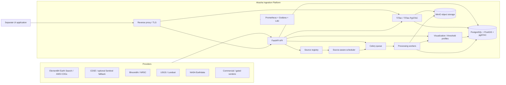
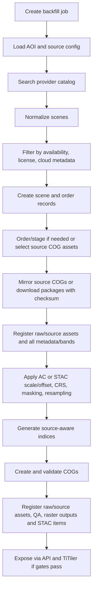

# Akasha Ingestion Architecture and Technical Stack

> For a client-facing, code-grounded walkthrough of the current two-VM deployment, all 20 catalog
> platforms, automatic ingestion/index processing, and product/frontend delivery, see
> [Akasha End-to-End Satellite Architecture](akasha-end-to-end-satellite-architecture.md). This
> technical-stack document remains the detailed source for platform decisions and evolution paths.

## 1. Executive summary

Akasha Ingestion should be built as a modular, self-hosted satellite data ingestion lake, raster processing, metadata catalog, and tile/API serving platform. The MVP should run on a single Linux VM using Docker Compose, and the production architecture should remain self-hostable on-premises with a clear path to multiple VMs or a lightweight orchestrator when high availability is required.

The recommended MVP stack is:

| Area | Recommended choice |
|---|---|
| Primary language | Python 3.11+ |
| API framework | FastAPI |
| Raster/geospatial processing | GDAL, Rasterio, Rioxarray, Xarray, NumPy, PyProj, Shapely, rio-cogeo |
| Atmospheric correction | Vendor surface reflectance where available; DOS interim and 6S/Py6S for ResourceSat |
| Spatial database | PostgreSQL + PostGIS, with pgSTAC strongly recommended |
| Object storage | MinIO |
| Task queue | Celery |
| MVP broker | Redis |
| Production broker upgrade path | RabbitMQ if stronger broker durability and routing are needed |
| Scheduler | Database-driven source scheduler using Celery Beat initially |
| Future workflow orchestrator option | Dagster or Prefect if pipeline DAG complexity grows |
| Tile service | TiTiler, preferably TiTiler-PgSTAC |
| Visualization and classification | Versioned display profiles, color ramps, threshold profiles, and class-area statistics |
| Deployment | Docker Compose for MVP and single-VM production |
| Production HA path | k3s or Docker Swarm on multiple VMs |
| Reverse proxy and TLS | Caddy or Traefik |
| Secrets | SOPS + age for MVP; Vault OSS or equivalent when rotation/audit becomes mandatory |
| Observability | Prometheus, Grafana, Loki, Alertmanager, Flower |
| Database migrations | Alembic |
| VM provisioning | Ansible |
| PostgreSQL backup | pgBackRest |
| Object backup/retention | MinIO versioning plus restic, replication, or separate backup storage; raw lifecycle cleanup disabled unless explicitly enabled |

The most important architecture decisions are:

1. Keep the science and raster pipeline Python-native because the strongest open-source geospatial libraries are Python/GDAL based.
2. Store rasters as per-scene Cloud Optimized GeoTIFFs, not permanent per-field TIFFs.
3. Retain reproducible source inputs by default: raw provider packages for package/download providers, and source STAC manifests plus AOI-complete source COG mirrors for STAC COG providers.
4. Use PostGIS/pgSTAC as the metadata and search catalog, with MinIO as the raster/object store.
5. Treat each satellite/instrument as configuration plus a provider adapter, not as custom one-off code.
6. Enforce provider-route-specific execution policies for auth, rate limits, throttling, retries, quotas, staging, mirroring/downloads, and checksums.
7. Use deterministic query-time best-scene selection for field analytics.
8. Keep scientific index outputs separate from display normalization, threshold classes, and agronomic interpretation.
9. Gate every source by validation, license/product exposure, and supported bands before serving outputs.
10. Make Azure development and on-prem production use the same container images and Compose topology so provider and GDAL behavior match.

This document intentionally keeps `docs/akasha-ingestion-plan.md` as the high-level source plan and expands it into an architecture and technology stack decision document.

## 2. Source inputs and constraints

This document is based on:

- `docs/akasha-ingestion-plan.md`
- `docs/reference/satellite-catalog.md`
- Independent Claude Opus 4.8 architecture review of the same source documents
- GPT-5.5 synthesis and final document review

### 2.1 Hard constraints

| Constraint | Architecture implication |
|---|---|
| Production is on-premises and self-hosted | Prefer OSS tools, local object storage, local DB, local observability, and no managed cloud dependencies. |
| Production runs on a Linux VM | Use Docker Compose first; keep host setup reproducible with Ansible. |
| Internet access is allowed in production | Provider APIs can be called directly, but egress, credentials, and IP whitelisting must be controlled. |
| Development uses an Azure Linux VM | Azure dev must mirror production OS, containers, storage layout, and service topology. |
| Current whitelisted machine is Azure VM | Use Azure VM for provider adapter validation until production static IP is whitelisted. |
| MVP AOI is Bangalore plus about 60 km radius | Optimize first for one regional AOI, but model AOI as configuration. |
| MVP backfill is 6 months | Backfill must be idempotent and restartable. |
| Reproducible source inputs are retained by default | Raw package cleanup and source COG mirror cleanup must be disabled unless an operator explicitly enables a scoped cleanup policy with pre-delete checks and audit logging. |
| UI is separate | This project exposes authenticated APIs, signed tile/stat URLs, metadata, and TiTiler-compatible outputs. |
| MVP optical sources are Sentinel-2, ResourceSat-2A, and Landsat 8/9 | Optical pipeline ships first; SAR is a separate later pipeline. |
| ResourceSat is an India differentiator | ResourceSat atmospheric correction and cloud masking are high-priority but high-risk workstreams. |

### 2.2 Open inputs that remain operational decisions

These should not be invented in code or documentation:

1. Exact Bangalore AOI polygon.
2. Clear-season backfill window for initial demo.
3. Final provider account/status for Bhoonidhi/NRSC, USGS/M2M, Earthdata, optional CDSE fallback, and any requester-pays AWS access.
4. ResourceSat atmospheric-correction ancillary data source for aerosol and water-vapour inputs.
5. Production server and static IP.
6. Expected API users and field-query volume.
7. Final retention period for processed COGs beyond the baseline.
8. Whether any source/AOI/environment should enable raw or source-mirror lifecycle cleanup; default is no cleanup.
9. Approval of generic visualization legends and threshold profiles for the first supported indices.
10. Crop-specific thresholds or agronomy rules by crop, season, region, and sensor/source.
11. Whether weather, soil, crop calendar, irrigation, or field observations should be integrated in the first interpretation layer or deferred.
12. Whether an internal operator dashboard is required in MVP or after MVP.

## 3. Architecture overview

### 3.1 Logical architecture



### 3.2 MVP deployment topology

The MVP should use one Linux VM with Docker Compose:

```text
Linux VM
  Docker Compose
    caddy or traefik
    api
    worker-optical
    worker-heavy
    scheduler
    redis
    postgres-postgis-pgstac
    minio
    titiler
    prometheus
    grafana
    loki
    alertmanager
    flower
    pgbackrest
```

This is the right MVP shape because it is inexpensive, easy to operate on-premises, and close to the production constraint. It is not highly available. That risk is acceptable for MVP only if backups and restore drills are implemented early.

### 3.3 Long-term production topology

The production path should avoid a rewrite:

| Stage | Topology | When to use |
|---|---|---|
| MVP | Single VM, Docker Compose | Bangalore AOI, initial backfill, first customer pilots. |
| Hardened single VM | Larger VM, RAID/ZFS storage, backup NAS, stricter monitoring | Early production where downtime is tolerable. |
| Multi-VM | Separate DB/storage/worker/API VMs, k3s or Docker Swarm | Higher uptime, more AOIs, heavier backfills, more concurrent queries. |
| Future scale | Multiple worker pools and replicated object/database services | Multi-region AOIs, commercial sources, SAR/ML workloads, stricter SLAs. |

## 4. Technology stack decisions

### 4.1 Backend language and API

| Option | Pros | Cons | Decision |
|---|---|---|---|
| Python + FastAPI | Best geospatial/raster ecosystem; easy async APIs; strong scientific libraries; TiTiler is FastAPI-native | CPU-heavy tasks need worker isolation; dependency pinning is important | Recommended |
| Go | Fast, simple deployment, good concurrency | Weak satellite/raster processing ecosystem compared with Python/GDAL | Not primary |
| Node.js | Good web API ecosystem | Poor fit for GDAL-heavy processing and scientific computation | Not recommended |

Use Python for both API and workers. Keep CPU-heavy work outside request handlers and route it through Celery workers.

### 4.2 Raster and geospatial processing

| Need | Recommended tools | Alternatives considered | Reasoning |
|---|---|---|---|
| Raster IO and reprojection | GDAL, Rasterio, Rioxarray | GRASS GIS, custom GDAL CLI scripts | Python libraries expose GDAL power while remaining testable and composable. |
| Multidimensional arrays | Xarray, NumPy | Pure Rasterio windows only | Xarray improves readability for band math and time-series stacks. |
| Vector geometry | Shapely, PyProj, GeoPandas where useful | Raw PostGIS only | App-side geometry validation and clipping are still needed. |
| COG creation | rio-cogeo, GDAL | Manual gdal_translate only | rio-cogeo provides validation-oriented COG workflows. |
| Index math acceleration | NumPy first; NumExpr or Numba later if needed | GPU acceleration | GPU is not needed for MVP vegetation indices. |
| ResourceSat AC | DOS interim, 6S/Py6S target | Paid ATCOR/FLAASH | OSS path is required; 6S is scientifically credible but operationally harder. |

All GDAL/PROJ/rasterio versions should be pinned in container images. Do not rely on host-installed geospatial libraries for production processing.

### 4.3 Database and metadata catalog

| Option | Pros | Cons | Decision |
|---|---|---|---|
| PostgreSQL + PostGIS | Mature, self-hosted, spatial indexes, transactional metadata | Need schema and indexing discipline | Required |
| PostgreSQL + PostGIS + pgSTAC | Adds STAC-native catalog/search; aligns with TiTiler-PgSTAC | More schema/tooling to learn | Strongly recommended |
| SpatiaLite | Lightweight | Not suitable for concurrent production catalog and job state | Not recommended |
| Elasticsearch/OpenSearch geo | Search-oriented | Adds operational complexity; not needed for authoritative metadata | Defer |

Use PostGIS as the authoritative metadata and job-state store. Prefer pgSTAC for STAC item/collection compatibility instead of inventing all scene-search semantics from scratch.

### 4.4 Object storage

| Option | Pros | Cons | Decision |
|---|---|---|---|
| MinIO | OSS, S3-compatible, self-hosted, lifecycle policies, good fit for COGs | Single-node MinIO is not HA | Recommended |
| Filesystem only | Simple | Harder to scale, hard to use S3-native tools, weaker bucket policies | Not recommended |
| Ceph | Highly scalable and redundant | Operationally heavy for MVP | Future only |
| SeaweedFS | Lightweight distributed storage | Smaller ecosystem than MinIO for S3 geospatial workflows | Alternative only |

Use MinIO buckets for raw/source manifests, mirrored source COGs, extracted/ARD where needed, indices, QA, reports, and backups. Enable bucket policies and versioning where useful. Lifecycle cleanup for raw packages and source COG mirrors is disabled by default.

### 4.5 Queue, scheduler, and workflow orchestration

| Option | Pros | Cons | Decision |
|---|---|---|---|
| Celery + Redis | Mature, simple, good for Python background jobs | Redis broker durability is weaker than RabbitMQ | MVP recommendation |
| Celery + RabbitMQ | Better routing, durability, priorities, long-running reliability | More operational complexity | Production upgrade path |
| RQ | Simple | Too limited for retries, routing, rate limits, and long tasks | Not recommended |
| Dramatiq | Cleaner than Celery in some cases | Smaller ecosystem | Alternative only |
| Airflow | Strong scheduled DAG UI | Heavy and less ideal for interactive API-triggered jobs | Not MVP |
| Prefect | Pythonic workflow orchestration, self-hostable | Extra service complexity | Consider after Phase 5 if DAGs grow |
| Dagster | Strong asset lineage and data observability | Learning curve and extra services | Strong future option for complex data assets |

Start with Celery, explicit job state in Postgres, and database-driven schedules. Do not let Celery task state be the only source of truth.

Recommended queues:

| Queue | Purpose |
|---|---|
| `search` | Provider catalog search jobs |
| `mirror` | Source COG mirroring from STAC assets into MinIO |
| `download` | Provider package downloads, checksums, resume for providers that require downloads |
| `preprocess` | Extraction, CRS validation, band preparation |
| `heavy-cpu` | ResourceSat AC, mosaicking, large warps |
| `cog` | COG generation and validation |
| `stats` | Field statistics and cacheable analytics |
| `maintenance` | cleanup, retention, reconciliation |

### 4.6 Tile serving

| Option | Pros | Cons | Decision |
|---|---|---|---|
| TiTiler | Lightweight, Python/FastAPI-native, COG-native | Raster-only; no full GIS admin UI | Recommended |
| TiTiler-PgSTAC | Dynamic tiling from STAC catalog; aligns with per-scene COG + query-time mosaic | Requires pgSTAC discipline | Preferred |
| GeoServer | Full GIS server, WMS/WMTS/WCS, vector and raster support | Heavy Java service; more admin burden | Not MVP |
| Terracotta | Lightweight raster serving | Less catalog/search power | Alternative for small demos |

Use TiTiler-PgSTAC when possible because the draft plan's per-scene COG baseline and MosaicJSON approach map naturally to STAC-backed tiling.

### 4.7 Reverse proxy, TLS, and API edge

| Option | Pros | Cons | Decision |
|---|---|---|---|
| Caddy | Simple config, automatic TLS, easy self-hosting | Less dynamic Docker service discovery than Traefik | Recommended default |
| Traefik | Docker-native routing, middleware, rate limiting | More moving parts | Good alternative |
| Nginx | Mature and fast | More manual TLS and config | Acceptable alternative |

Use the reverse proxy as the only public ingress. Keep MinIO, Postgres, Redis/RabbitMQ, workers, and admin tools on internal networks.

### 4.8 Authentication, authorization, and rate limiting

| Option | Pros | Cons | Decision |
|---|---|---|---|
| App-layer API keys | Simple for MVP integrations | Limited identity model | MVP baseline |
| JWT/OAuth2 via app | Works for service clients | More code to secure | Use only if needed |
| Authentik | OSS, lighter than Keycloak, OIDC support | Extra service | Good production option |
| Keycloak | Mature enterprise OIDC | Heavier | Use if enterprise SSO is required |
| mTLS | Strong service/client identity | Operationally more complex | Use for internal/high-trust clients if required |

MVP should support API keys or signed client tokens, per-client rate limits, audit logging, geometry-size limits, and signed tile/stat URLs. Do not expose internal MinIO paths.

### 4.9 Secrets management

| Option | Pros | Cons | Decision |
|---|---|---|---|
| Environment files only | Simple | Easy to leak; weak rotation | Not sufficient |
| Docker secrets | Better than env files | Compose-only ergonomics are limited; weak audit/rotation | Use only as supporting mechanism |
| SOPS + age | Git-friendly encrypted secrets, simple for small teams | Rotation/audit are process-driven | MVP recommendation |
| Vault OSS | Strong secret lifecycle and audit | More operational complexity | Production hardening option |
| Infisical OSS | Developer-friendly secret management | Another service to operate | Alternative |

Provider credentials must never be stored in plain database fields. Store only `secret_ref` in metadata.

### 4.10 Observability

| Need | Recommended tool | Reasoning |
|---|---|---|
| Metrics | Prometheus | OSS standard and easy Compose deployment. |
| Dashboards | Grafana | Standard visualization for API, workers, DB, MinIO, host, queue. |
| Logs | Loki with Promtail or Grafana Alloy | Lighter than ELK for a single VM. |
| Alerts | Alertmanager | Needed for disk, backup, failed jobs, service health. |
| Celery visibility | Flower | Operators need queue/task visibility early. |
| Host metrics | node_exporter | CPU, memory, disk, network. |
| Container metrics | cAdvisor | Container resource visibility. |
| Optional tracing | OpenTelemetry + Tempo | Useful later for cross-service job tracing. |

### 4.11 CI/CD and infrastructure automation

| Option | Pros | Cons | Decision |
|---|---|---|---|
| Manual SSH deployment | Fast initially | Not reproducible | Avoid beyond earliest spike |
| GitHub Actions self-hosted runner | Good if repo uses GitHub | Needs runner hardening | Recommended if available |
| Gitea Actions | Self-hostable | Extra service | Alternative |
| Jenkins | Powerful | Heavy | Not MVP |
| Ansible | Simple VM provisioning and repeatable setup | Imperative, needs discipline | Recommended |
| Terraform | Good for cloud resources | Less useful for final on-prem bare VM | Optional for Azure VM creation |

Use Ansible to bootstrap both Azure dev and on-prem production. Use CI to build pinned images, run tests, validate migrations, and publish image tags.

## 5. Environment strategy

### 5.1 Environment parity principle

Azure development and on-prem production should differ only by configuration and capacity, not by software architecture.

| Layer | Parity rule |
|---|---|
| OS | Same Ubuntu Server LTS family where possible. |
| Containers | Same images and tags in dev and prod. |
| Compose topology | Same base `docker-compose.yml`; environment overlays only. |
| GDAL/PROJ | Pinned inside images; never depend on host versions. |
| Provider adapters | Same code paths; dev uses whitelisted Azure IP until prod IP is approved. |
| Sample data | Use Phase 0 sample scenes as repeatable fixtures. |
| Config | Same config schema; different values via env/secrets. |

### 5.2 Azure Linux development VM

Purpose:

- Validate provider access from the currently whitelisted machine.
- Run sample-product spike and adapter validation.
- Mirror production deployment with smaller data volumes.
- Host CI runner if needed.

Recommended minimum for serious integration testing:

| Component | Dev VM recommendation |
|---|---|
| OS | Ubuntu Server 24.04 LTS or 22.04 LTS |
| CPU | 8 to 16 vCPU |
| RAM | 32 to 64 GB |
| OS disk | 128 GB |
| Data disk | 1 to 2 TB managed disk for MinIO and sample scenes |
| Scratch disk | Fast local/NVMe if available, mounted at `/scratch` |
| Network | Static public IP if provider whitelisting depends on it |

Install on host:

| Category | Packages/tools |
|---|---|
| Base ops | `curl`, `git`, `gh`, `jq`, `unzip`, `rsync`, `htop`, `iotop`, `ncdu`, `ca-certificates` |
| Security | `ufw`, `fail2ban`, unattended upgrades |
| Time | `chrony` |
| Containers | Docker Engine, Docker Compose plugin |
| Provisioning | Ansible |
| Storage/admin clients | MinIO client `mc`, PostgreSQL client tools |
| Observability host agents | node_exporter, cAdvisor through Compose |
| Optional diagnostics | GDAL CLI inside container, not required on host |

### 5.3 On-prem production VM

Baseline from the high-level plan:

| Component | MVP production minimum | Recommended production |
|---|---:|---:|
| CPU | 16 cores | 32 cores |
| RAM | 64 GB | 128 GB |
| NVMe scratch | 1 to 2 TB | 2 to 4 TB |
| Object storage | 4 to 8 TB usable | 16 to 32 TB usable, expandable |
| Network | 1 Gbps preferred | 1 Gbps minimum |
| GPU | Not required | Optional later for ML only |
| OS | Ubuntu Server LTS | Ubuntu Server LTS |

Production-specific requirements:

- Static public IP for Bhoonidhi/NRSC and other provider whitelisting.
- Separate data volume for MinIO.
- Separate scratch volume for GDAL temporary files.
- Separate backup target such as NAS, external object store, or replicated MinIO.
- Firewall allowing only SSH from admin IPs and HTTPS from allowed clients.
- TLS certificates for public API/tile endpoints.
- No public access to raw MinIO buckets.

### 5.4 Common VM setup checklist

1. Install Ubuntu Server LTS.
2. Create non-root `deploy` user with SSH key-only login.
3. Disable password SSH login.
4. Enable `ufw` default deny.
5. Allow only SSH from admin networks and HTTPS to public services.
6. Install Docker Engine and Compose plugin.
7. Enable unattended security updates.
8. Install and enable `chrony`.
9. Mount persistent disks:
   - `/srv/akasha/postgres`
   - `/srv/akasha/minio`
   - `/srv/akasha/monitoring`
   - `/srv/akasha/backups`
   - `/scratch/akasha`
10. Configure Docker log rotation.
11. Deploy base Compose stack.
12. Run database migrations.
13. Create MinIO buckets and policies.
14. Load encrypted secrets.
15. Validate provider egress and whitelisted IP.
16. Verify health checks.
17. Configure backups and run a restore test.
18. Configure dashboards and alerts.

## 6. Deployment model

### 6.1 Compose layout

Use a base Compose file plus overlays:

```text
deploy/
  docker-compose.yml
  compose.dev.yml
  compose.prod.yml
  env/
    dev.example.env
    prod.example.env
  caddy/
  prometheus/
  grafana/
  loki/
  alertmanager/
  pgbackrest/
```

The base graph should define all services. Dev/prod overlays should only change:

- resource limits
- exposed hostnames
- replica counts where supported
- volume paths
- log retention
- backup targets
- provider credential references

### 6.2 Service containers

| Service | Responsibility |
|---|---|
| `api` | External and internal FastAPI endpoints. |
| `scheduler` | Source-aware schedule evaluation and job creation. |
| `worker-search` | Provider catalog search. |
| `worker-download` | Download, checksum, resume, provider order polling. |
| `worker-process` | Extraction, preprocessing, index math, COG generation. |
| `worker-heavy` | ResourceSat AC, large reprojection, mosaicking. |
| `titiler` | COG tile and statistics serving. |
| `postgres` | Metadata, job state, PostGIS, pgSTAC. |
| `minio` | Raw, extracted, ARD, COG, QA, reports, backup objects. |
| `redis` | MVP broker and cache. |
| `rabbitmq` | Optional production broker upgrade. |
| `caddy` or `traefik` | TLS, routing, ingress, basic edge rate limiting. |
| `prometheus` | Metrics collection. |
| `grafana` | Dashboards. |
| `loki` | Logs. |
| `alertmanager` | Alerts. |
| `flower` | Celery worker/job visibility. |
| `pgbackrest` | PostgreSQL backups and restore tooling. |

### 6.3 Release flow

1. Build versioned images.
2. Run unit and integration tests.
3. Run migration dry-run where possible.
4. Deploy to Azure dev.
5. Validate sample-scene processing.
6. Promote the same image tags to production.
7. Run Alembic migrations.
8. Run health checks.
9. Run smoke tests:
   - `/health`
   - source registry query
   - sample field-index query
   - TiTiler tile request for a known COG
   - worker job execution
10. Monitor dashboards and logs after deployment.

## 7. Satellite and provider integration architecture

### 7.1 Design principle

Adding a satellite should be mostly configuration plus a provider adapter. The pipeline must not hard-code assumptions that all satellites:

- have the same band set
- use the same provider access pattern
- provide surface reflectance
- provide cloud masks
- support the same indices
- can be exposed to clients immediately

### 7.2 Source registry

The satellite catalogue should be the business source of truth. One catalogue slug can map to multiple processing source rows when instruments differ.

Example:

| Catalogue slug | Source rows | Reason |
|---|---|---|
| `resourcesat-2a` | `resourcesat-2a-liss4-mx70-l2`, `resourcesat-2a-liss3-boa`, `resourcesat-2a-awifs-boa` | Different instruments, bands, resolution, swath, supported indices. |
| `landsat-8` | `landsat-8-c2-l2` | One operational processing product. |
| `sentinel-2` | `sentinel-2-l2a` | L2A surface reflectance and SCL mask. |
| `sentinel-1` | `sentinel-1-grd` | SAR pipeline, not optical index pipeline. |

Each source row should include:

| Field | Purpose |
|---|---|
| `catalog_slug` | Stable catalogue business key. |
| `source_id` | Processing source identifier. |
| `provider_adapter` | Legacy/default/display adapter key such as `earthsearch`, `bhoonidhi`, `usgs`, `cdse`, `earthdata`, `planet`, `vendor`. |
| `instrument_mode` | LISS-3, LISS-4, AWiFS, OLI, MSI, etc. |
| `analysis_level` | L2A, C2L2, BOA, TOA, DN. |
| `bands` | Exact available bands. |
| `supported_indices` | Derived from band availability and processing profile. |
| `processing_profile` | AC, masking, resampling, COG profile. |
| `validation_profile` | Required validation before exposure. |
| `product_exposure` | Hidden, internal QA, product active, blocked. |
| `license_profile` | Serving constraints and attribution/exposure rules. |
| `credential_ref` | Legacy/default credential reference only; route-specific credentials belong on provider routes. |
| `execution_policy_ref` | Legacy/default policy reference only; route-specific execution policy belongs on provider routes. |
| `schedule_state` | Routine, gated, archive-only, disabled, manual-only. |

`source_provider_routes` is the authoritative model for adapter, access mode, credentials, and
execution policy when a logical source has multiple routes, such as Sentinel-2 Earth Search primary
plus optional CDSE fallback or Landsat Earth Search primary plus USGS fallback. Source-level provider
fields are defaults/display metadata and must not block a source because an optional route lacks
credentials.

### 7.3 Provider adapter contract

Every provider adapter should implement the same conceptual interface:

| Method | Responsibility |
|---|---|
| `authenticate()` | Resolve provider credentials and create a session/token when the provider route requires auth. No-op for public Earth Search Sentinel-2. |
| `search(aoi, date_range, source_config)` | Return provider scenes matching AOI/date/source constraints. |
| `normalize_scene(provider_record)` | Convert provider-specific metadata into internal scene metadata. |
| `order(scene)` | Submit order if the provider requires staging. No-op for direct-download providers. |
| `poll_order(order)` | Check accepted/staged/failed/expired state. |
| `get_assets(scene_or_order)` | Return downloadable assets, external STAC asset hrefs, alternates, roles, and expiry metadata. |
| `mirror_or_download(asset, destination)` | Mirror source COGs or download packages with checksum and retry according to route policy. |
| `parse_metadata(local_or_object_path)` | Extract or normalize product/STAC manifest, all available assets/bands, CRS, scale, offsets, and QA assets. |
| `validate_license(scene)` | Confirm the scene can be processed and exposed according to source policy. |

Provider adapters should also expose a capability descriptor:

| Capability | Examples |
|---|---|
| Auth type | None/public STAC, OAuth2, API key, session cookie, manual token, mTLS, requester-pays AWS. |
| Access pattern | STAC COG mirror, direct download, order/staging, manual vendor upload. |
| Checksum type | MD5, SHA256, provider manifest, none. |
| Rate limits | Requests per minute, daily quota, concurrent downloads. |
| URL expiry | Required for staged providers. |
| Product levels | L2A, C2 L2, BOA, TOA, DN. |
| Cloud metadata | Scene cloud percent, mask band, none. |

### 7.3.1 Provider execution policy

Provider behavior must be configuration-driven because each provider route can have different authentication, request, order, staging, quota, mirror, and download rules.

Each provider/source should have an execution policy:

| Field | Purpose |
|---|---|
| `auth_model` | OAuth2, API key, session cookie, mTLS, signed URL, manual token, etc. |
| `requests_per_minute` | API request throttle. |
| `max_concurrent_searches` | Search concurrency limit. |
| `max_concurrent_mirrors` | Source COG mirror concurrency limit. |
| `max_concurrent_downloads` | Download concurrency limit for package/download providers. |
| `daily_quota` | Optional daily cap for searches, orders, scenes, or bytes. |
| `retry_policy_json` | Retry count, backoff, jitter, and retryable provider errors. |
| `staging_policy_json` | Order/poll/re-stage behavior and URL expiry handling. |
| `checksum_policy_json` | Required checksum algorithm and failure behavior. |
| `availability_lag_hours` | Expected delay after acquisition before product availability. |
| `priority_class` | Backfill, routine sync, UI-triggered, or admin/manual. |

Execution policy enforcement belongs in the job scheduler/worker layer, not inside ad hoc adapter code. Adapters expose provider capabilities; workers enforce policy through queue routing, token-bucket or equivalent rate limiting, concurrency semaphores, retry/backoff, and backpressure.

Worker isolation rules:

1. Use separate queues for provider search, download, processing, heavy processing, and UI-facing analytics.
2. Route provider jobs through provider/source-specific rate limiters.
3. Do not let a six-month backfill starve routine sync or UI-triggered field analytics.
4. Keep ResourceSat AC and large mosaicking in heavy workers with separate CPU/scratch controls.
5. Store execution-policy version on jobs for reproducibility and debugging.

### 7.4 MVP provider mapping

| Source | Primary route/adapter | MVP state | Notes |
|---|---|---|---|
| Sentinel-2 L2A | `earthsearch:sentinel-2-l2a` | First vertical slice | Vendor SR and SCL mask through Earth Search/AWS COGs make this fastest end-to-end proof; CDSE is optional future fallback. |
| ResourceSat-2A LISS-4 | `bhoonidhi` | Parallel India differentiator | High-resolution VNIR; no SWIR or red edge. |
| ResourceSat-2A LISS-3 | `bhoonidhi` | Parallel India differentiator | Includes SWIR; useful for NDMI/NDBI. |
| ResourceSat-2A AWiFS | `bhoonidhi` | Coarse/regional support | Lower resolution; use carefully for small fields. |
| Landsat 8/9 C2 L2 | `earthsearch:landsat-c2-l2`, `usgs` fallback | MVP continuity/gap-fill | Surface reflectance and QA_PIXEL; requester-pays access is opt-in. |
| Sentinel-1 GRD | `earthsearch:sentinel-1-grd` | Deferred | SAR-specific pipeline, not NDVI replacement. |

### 7.5 Activation gates

A source should only become externally visible when all gates pass:

1. Provider route access validated, including credential validation only when the route requires credentials.
2. Search and source mirror/download tested.
3. Product or STAC metadata parsed.
4. All available assets/bands inventoried and required bands mapped correctly.
5. AC/masking profile validated.
6. COG output validates.
7. Supported indices verified.
8. License/product exposure policy permits serving.
9. Field query returns correct tile/stat metadata.
10. Provenance versions are recorded.

## 8. Processing workflow architecture

### 8.1 Backfill workflow



Backfill requirements:

- Idempotency key per source, AOI, date range, product ID, and processing version.
- Checkpoints after search, order/stage when needed, source mirroring or download, extraction/metadata normalization, processing, and COG registration.
- Duplicate detection by provider product ID and checksum.
- Source asset registration and source COG mirroring before processing for STAC COG providers; raw provider package registration before extraction for package providers.
- All-band/asset inventory for every supported product.
- Provider execution-policy enforcement for search, order, poll, mirror, and download stages.
- Retryable failures must preserve enough state to resume.
- Failed products must have explicit status and error category.

### 8.2 Scheduled sync workflow

The scheduler should be source-aware:

| Source type | Schedule behavior |
|---|---|
| Sentinel-2 | Check according to 2 to 5 day cadence and provider availability lag. |
| ResourceSat-2A | Check according to 5 day cadence and Bhoonidhi staging/order behavior. |
| Landsat 8/9 | Check according to 16 day per-satellite cadence and 8 day combined continuity. |
| MODIS/EOS-06 | Later regional/context schedules only. |
| Archive-only sources | No routine schedule; on-demand only. |
| Commercial/gated sources | Search/order disabled until contract and quota are configured. |
| SAR sources | Separate SAR schedule and processing pipeline. |

### 8.3 Provider order/staging state machine

```text
discovered
  -> ordered
  -> accepted
  -> staged
  -> downloaded
  -> verified
  -> extracted
  -> processed
  -> published
```

Failure states:

```text
rejected
expired
download_failed
checksum_failed
metadata_failed
processing_failed
validation_failed
license_blocked
```

The state machine should be stored in Postgres, not only in Celery.

### 8.4 Best-scene selection

The API should resolve "latest" and "best" at query time:

1. Use requested date plus/minus 7 days.
2. Filter to active, validated sources that support the requested index.
3. Filter to scenes that cover the field, or same-date scene sets that can mosaic the field.
4. Compute field-level usable pixels after mask/no-data.
5. Require at least configured usable-pixel percentage and minimum valid pixel count.
6. Rank by:
   - source priority
   - lower field cloud percentage
   - higher/native suitable resolution
   - nearest date
7. Return `UNAVAILABLE` if no valid optical scene exists in the window.

Do not silently interpolate, widen the date window, or substitute SAR as NDVI.

## 9. Raster and geospatial design

### 9.1 CRS strategy

| Data | CRS rule |
|---|---|
| Raw products | Preserve native CRS and metadata. |
| API input geometry | Accept EPSG:4326. |
| Bangalore MVP processing | Use UTM zone 43N, EPSG:32643, where suitable. |
| Future AOIs | Select AOI-appropriate projected CRS; do not hard-code Bangalore CRS globally. |
| Stored COG metadata | Record native CRS, processing CRS, resolution, and transform. |

### 9.2 Resampling rules

Resampling must be data-type aware:

| Raster type | Resampling method |
|---|---|
| Continuous reflectance bands | Bilinear or cubic, chosen per profile. |
| Vegetation index COGs | Average for overviews; bilinear for display resampling if needed. |
| Cloud masks | Nearest neighbor only. |
| SCL/classification layers | Nearest neighbor only. |
| No-data masks | Nearest neighbor only. |

Never apply bilinear/cubic resampling to categorical masks.

### 9.3 Scale, offset, nodata, and division rules

Every index calculation must explicitly handle:

- Source-specific scale and offset.
- No-data, QA, cloud/shadow, saturated, and invalid mask construction before scale/offset.
- Reflectance conversion only for valid pixels before index math.
- No-data propagation.
- Cloud/shadow/invalid mask propagation.
- Division-by-zero.
- Saturated pixels.
- Output clipping to valid index range where appropriate.
- Formula version recording.

For STAC COG providers, the required order is: read nodata and QA/mask assets, build the validity
mask, apply scale/offset only to valid pixels, then run index math. This prevents nodata DN values
from becoming valid negative reflectance when an asset has a negative offset.

### 9.4 Atmospheric correction profiles

| Source | MVP correction profile |
|---|---|
| Sentinel-2 | Use L2A surface reflectance. No custom AC. |
| Landsat 8/9 | Use Collection 2 Level 2 surface reflectance. No custom AC. |
| ResourceSat-2A | DOS interim, then 6S/Py6S with ancillary inputs. Exposure gated until validation passes. |

ResourceSat AC is the highest scientific risk. The platform should support a rejected/unavailable status if ResourceSat cannot be corrected to acceptable surface reflectance.

### 9.5 Cloud and quality masks

| Source | Mask profile |
|---|---|
| Sentinel-2 | SCL layer, optional s2cloudless supplement. |
| Landsat 8/9 | QA_PIXEL cloud, cloud shadow, cirrus bits. |
| ResourceSat-2A | Custom spectral/spatial/temporal mask with `confidence: unknown` until validated. |
| SAR | Separate SAR quality logic, not optical cloud masking. |

Quality should be computed at scene level and field level. Field-level usability is authoritative for field analytics.

### 9.6 COG output standard

| Setting | Recommendation |
|---|---|
| Format | Cloud Optimized GeoTIFF |
| Encoding | Int16 scaled by 10000, or Float32 where needed |
| Nodata | Explicit nodata value |
| Compression | ZSTD preferred; DEFLATE acceptable |
| Internal tiling | 512 x 512 |
| Overviews | Internal overviews |
| Masks | Internal mask/alpha where appropriate |
| Validation | `rio cogeo validate` |
| Metadata | Source, scene, processing versions, formula, AC, mask, CRS |

### 9.7 Visualization, classification, and interpretation design

Scientific raster outputs and user-facing map interpretation should be separate concerns:

```text
corrected and masked reflectance bands
  -> source-aware index formula
  -> per-scene index COG
  -> visualization profile
  -> threshold profile
  -> class-area statistics
  -> optional agronomic interpretation
```

Use versioned profile registries instead of hard-coded map classes:

| Profile | Responsibility |
|---|---|
| `visualization_profiles` | Index display domain, display min/max, color ramp, no-data color, and palette version. |
| `threshold_profiles` | Ordered class ranges, labels, colors, crop/season/AOI/source overrides, and threshold version. |
| `interpretation_profiles` later | Crop/season/weather/soil-aware agronomic rules or model references. Not required for MVP index output. |

Rules:

1. The index formula engine only calculates index values from valid, corrected, masked bands.
2. Display normalization never changes the stored scientific index value.
3. Generic thresholds are allowed for map readability, but must be labelled as generic.
4. Crop-health claims require approved crop/season/region calibration and should not be inferred from NDVI alone.
5. The API should return both continuous field statistics and class-area statistics.
6. Profile IDs and versions must be recorded in field query responses for reproducibility.

Default NDVI classes can follow the common remote-sensing visualization pattern:

| NDVI range | Generic class |
|---|---|
| `-1.00..0.00` | Water / non-vegetation |
| `0.00..0.15` | Bare soil / very sparse vegetation |
| `0.15..0.30` | Poor vegetation |
| `0.30..0.45` | Low to medium growth |
| `0.45..0.60` | Moderate growth |
| `0.60..0.75` | Healthy crop |
| `0.75..1.00` | Very dense / highly healthy canopy |

These ranges are a default visualization profile, not a validated crop diagnosis. NDRE, MSAVI, NDMI, NDBI, and future indices need their own profiles.

## 10. Storage design

### 10.1 MinIO bucket/prefix model

Use a single logical bucket or several buckets depending on operator preference. A single bucket with clear data-lake zones is acceptable for MVP:

```text
akasha-data/
  raw/{provider}/{source_id}/{product_id}/
    original.*
    checksum.txt
    provider-manifest.*
  extracted/{provider}/{source_id}/{product_id}/
    bands/
    masks/
    metadata/
    asset-inventory.json
  ard/{provider}/{source_id}/{product_id}/
    surface_reflectance/
    aligned_bands/
    masks/
  indices/{provider}/{source_id}/{product_id}/{index}.cog.tif
  qa/{provider}/{source_id}/{product_id}/
  analytics/{field_id}/{index}/
  reports/{field_id}/{date}/
  mosaics/{aoi_id}/{index}/{date}/
  tmp/
```

Do not return these internal paths to clients. Clients receive opaque layer IDs and signed URLs.

Lake-zone rules:

| Zone | Meaning | Default lifecycle |
|---|---|---|
| `raw/` | Bronze/native provider packages exactly as received. | Retain by default; cleanup disabled unless explicitly enabled. |
| `extracted/` | Unpacked product members, metadata, all-band/asset inventory. | Retain while useful for reprocessing and debugging. |
| `ard/` | Analysis-ready surface reflectance, aligned bands, and masks. | Retain according to processing/reprocessing policy. |
| `indices/` | Derived index COGs. | Retain for analytics history; configurable. |
| `qa/` | Cloud masks, usable-pixel masks, previews, validation artifacts. | Retain with provenance. |
| `analytics/` | Cached field stats, time-series, progressive NDVI summaries. | Retain by business policy. |
| `reports/` | Report-ready outputs. | Optional, post-MVP. |

### 10.2 Retention policy implementation

The raw lake defaults to no deletion. Lifecycle cleanup is an operator-controlled feature, not an automatic default:

| Data | Policy | Mechanism |
|---|---|---|
| Raw ZIP/native products | Retain by default | MinIO lifecycle disabled unless operator enables scoped cleanup. |
| Extracted bands | Retain as needed for reproducibility or reprocessing | Configurable lifecycle by source. |
| ARD/minimal bands | Keep longer than raw where storage permits | Separate lifecycle class. |
| Index COGs | 1 to 3 years or configured | Lifecycle by AOI/source/index. |
| Metadata/provenance | Long-term | Postgres backup and migration discipline. |
| Field statistics | Long-term where business requires | Postgres tables partitioned by date if volume grows. |
| Logs | 6 to 12 months | Loki retention. |

Before raw deletion:

1. Operator explicitly enables cleanup for a source/AOI/environment scope.
2. Confirm required derived outputs exist.
3. Confirm checksums and product IDs are stored.
4. Confirm provenance and lineage are complete.
5. Confirm backup or re-download strategy is acceptable.
6. Mark raw object as cleanup-eligible.
7. Let lifecycle or cleanup worker delete it.
8. Record deletion event in audit log.

Storage sizing must assume raw data grows until an operator explicitly enables cleanup.

### 10.3 Scratch storage

GDAL warp, AC, decompression, and COG creation need fast scratch disk:

- Mount scratch at `/scratch/akasha`.
- Set worker `TMPDIR` and GDAL temp paths there.
- Enforce cleanup after task completion.
- Monitor scratch usage and alert before exhaustion.
- Do not place long-term data only on scratch.

## 11. Database, catalog, and metadata design

### 11.1 Database roles

PostgreSQL/PostGIS should hold:

- source registry
- provider credentials references
- provider execution policies
- AOI registry
- provider scenes
- provider orders
- scene assets
- processing jobs
- raster outputs
- visualization profiles
- threshold profiles
- tile layer registry
- field queries
- field time-series queries and progressive NDVI summaries
- audit logs
- STAC collections/items if pgSTAC is used

### 11.2 pgSTAC recommendation

Use pgSTAC to represent scene/raster assets as STAC collections and items. Keep Akasha-specific operational tables for job state, provider orders, validation, and licensing.

Benefits:

- STAC-compatible metadata model.
- Better alignment with TiTiler-PgSTAC.
- Easier future integration with external tools.
- Less custom search logic.

### 11.3 Required indexes and constraints

Add indexes intentionally:

| Table | Index |
|---|---|
| `provider_scenes` | GIST on `scene_geometry` |
| `provider_scenes` | btree on `source_id`, `acquisition_date`, `status` |
| `provider_scenes` | unique on provider/product ID |
| `provider_execution_policies` | btree on `provider_adapter`, `source_id`, `enabled` |
| `scene_assets` | btree on `scene_id`, `asset_kind`, `band_role` |
| `aoi_registry` | GIST on `geometry` |
| `raster_outputs` | btree on `scene_id`, `index_name` |
| `visualization_profiles` | unique on `index_name`, `version` |
| `threshold_profiles` | btree on `index_name`, `crop`, `season`, `aoi_id`, `source_id` |
| `processing_jobs` | btree on `status`, `job_type`, `created_at` |
| `field_queries` | GIST on `field_geometry` |
| `audit_log` | btree on `created_at`, `actor`, `event_type` |

Partition large time-series or job/history tables by date if query volume grows.

### 11.4 Migrations

Use Alembic for schema migrations. Migrations should be part of release flow and should run before new workers start processing new schema-dependent jobs.

## 12. API and serving architecture

### 12.1 API conventions

Use versioned routes:

```text
/api/v1/sources
/api/v1/ingestion/sync
/api/v1/jobs/{jobId}
/api/v1/analytics/field-index
/api/v1/analytics/field-timeseries
/api/v1/analytics/field-progressive-ndvi
/api/v1/admin/...
```

API rules:

- External APIs require authentication.
- Internal/admin APIs are network-isolated and separately authorized.
- Geometry input is EPSG:4326 unless otherwise declared.
- Request geometry size and vertex count are capped.
- API responses never include MinIO paths, object keys, `s3://` URLs, Earth Search hrefs, AWS Open Data hrefs, signed provider URLs, or client-supplied raw COG targets.
- Every response includes source, date, quality, resolution, and provenance where relevant.
- Analytics responses include display profile, threshold profile, and class-area statistics when a classification profile is applied.
- Time-series/progressive analytics responses include source, sensor, resolution, quality, and harmonization flags per point.
- Error responses use a consistent schema.

### 12.2 Serving model

| Layer | Responsibility |
|---|---|
| FastAPI | Auth, request validation, best-scene selection, signed URL generation, field stats orchestration. |
| TiTiler-PgSTAC | Dynamic COG tile/stat serving from cataloged assets. |
| MinIO | COG/object storage behind internal network. |
| PostGIS/pgSTAC | Scene search, source support, asset lookup, metadata. |

For field index requests:

1. API validates auth and geometry.
2. API selects best scene or mosaic candidate.
3. API resolves the visualization profile and threshold profile for the requested index/source/crop context.
4. API creates or resolves opaque `layerId`.
5. API returns signed tile/stat URLs, continuous statistics, class-area statistics, legend metadata, and profile versions.
6. TiTiler serves only authorized layer references, not raw paths or external provider hrefs.

For progressive NDVI requests:

1. API validates auth, geometry, AOI containment, and date range.
2. API selects valid NDVI scenes across the requested window using the same source/index/quality rules.
3. API returns dated points with source, sensor, resolution, cloud/usable-pixel quality, and selected-scene provenance.
4. API returns summary metrics: first valid value, latest value, min, max, mean, latest-vs-first delta, trend slope, unavailable periods, and source-mix/harmonization flags.
5. Cached summaries may be stored in `analytics/`, but raw and derived scene assets remain the source of truth.

### 12.3 Signed URLs

Signed URLs should include:

- layer ID
- allowed operation
- expiry timestamp
- client or tenant ID
- optional geometry/query hash
- HMAC signature

Keep TTL short for tile/stat URLs. Longer-lived refresh should require authenticated API calls.

## 13. Security, licensing, and exposure controls

### 13.1 Security controls

| Control | Implementation |
|---|---|
| TLS | Caddy or Traefik. |
| API auth | API keys/JWT for MVP; OIDC provider later if needed. |
| Rate limits | Reverse proxy plus app-level per-client counters. |
| Geometry limits | API validation. |
| Secrets | SOPS + age initially; Vault OSS later if needed. |
| Internal network | Compose private networks for DB, MinIO, queue, workers. |
| Admin endpoints | VPN/admin IP allowlist or internal-only exposure. |
| Audit logging | Download, processing, API access, product exposure changes. |
| Log redaction | Provider credentials and signed URLs redacted. |

### 13.2 License and product exposure gates

Every serving path must check:

1. Source is active.
2. Product exposure permits external serving.
3. License profile allows the requested use.
4. Validation profile has passed.
5. Client is authorized for that source or product tier.

This is especially important for:

- NRSC/Bhoonidhi products.
- Commercial sources.
- Manual vendor uploads.
- High-resolution or gated sources.

## 14. Observability and operations

### 14.1 Metrics

Track:

- API request count, latency, errors.
- Field-index query count and unavailable rate.
- Field time-series/progressive NDVI query count, latency, and unavailable-period rate.
- Provider search/download success and failure.
- Provider rate-limit waits, throttled requests, quota usage, and retry/backoff counts.
- Download bytes and duration.
- Queue depth by queue.
- Task duration by stage.
- Worker CPU/memory.
- GDAL scratch disk usage.
- MinIO disk usage, object count, error rate.
- Postgres connections, locks, slow queries.
- Backup success/failure.
- COG validation failures.
- Cloud/quality rejection counts.
- Field classification profile usage and missing-profile fallbacks.
- Generic-threshold responses versus crop-specific calibrated responses.

### 14.2 Logs

Use structured JSON logs with:

- trace/job ID
- source ID
- provider product ID
- scene ID
- task name
- attempt number
- status
- error category
- duration

Do not log credentials, raw signed URLs, or provider tokens.

### 14.3 Dashboards

Minimum Grafana dashboards:

1. System overview.
2. API health.
3. Queue and worker health.
4. Provider ingestion.
5. Processing pipeline.
6. Storage and retention.
7. Database health.
8. Backup/restore health.
9. Field analytics quality.

### 14.4 Alerts

Minimum alerts:

- API down.
- TiTiler down.
- Postgres down.
- MinIO down.
- Queue backlog above threshold.
- Worker failures above threshold.
- Disk usage above threshold.
- Scratch disk near full.
- Backup failed.
- Provider auth failing.
- Product exposure attempted before validation.
- Retention cleanup failed.

## 15. Reliability design

### 15.1 Idempotency

Use idempotency at each durable boundary:

| Boundary | Idempotency key |
|---|---|
| Search | provider + source + AOI + date range |
| Scene | provider + provider product ID |
| Download | scene ID + asset role + checksum |
| Processing | scene ID + processing profile version |
| Index output | scene ID + index + formula version + mask version + AC version |
| Field query cache | geometry hash + index + requested date + selection policy version |
| Progressive NDVI cache | geometry hash + date range + source policy + selection policy version |

### 15.2 Retry policy

| Failure | Retry? | Notes |
|---|---|---|
| Provider timeout | Yes | Exponential backoff and provider rate limit. |
| Provider throttle/quota hit | Yes, delayed | Pause according to execution policy; do not spin retries. |
| URL expired | Yes | Return to order/poll state. |
| Checksum mismatch | Yes, limited | Redownload asset; mark failed if repeated. |
| Missing required band | No | Mark validation failed. |
| Unsupported index | No | Reject request/config. |
| AC failed | Limited | Retry if transient; otherwise validation failed. |
| COG validation failed | Limited | Recreate once; then failed. |
| License blocked | No | Requires operator/policy change. |

### 15.3 Backpressure and quotas

Provider adapters should enforce:

- max concurrent searches
- max concurrent downloads
- per-provider request rate
- daily quota where applicable
- worker queue routing per provider
- priority separation between backfill, routine sync, and UI-triggered analytics

Do not let a large backfill starve field analytics or small sync jobs.

## 16. Backup, restore, and disaster recovery

### 16.1 PostgreSQL

Use pgBackRest:

- full backup schedule
- incremental backup schedule
- WAL archiving for point-in-time recovery
- encrypted backup repository
- backup retention policy
- restore test on Azure dev or staging VM

### 16.2 MinIO objects

Use:

- bucket versioning for important outputs where practical
- lifecycle rules for raw retention
- replication or restic backup to separate storage
- periodic object inventory/reconciliation against metadata

### 16.3 Config and secrets

Back up:

- Compose files
- Ansible inventory/playbooks
- encrypted SOPS files
- Grafana dashboards
- Prometheus/Loki/Alertmanager config
- Caddy/Traefik config
- database migration history

### 16.4 Disaster recovery posture

For MVP, document that single-VM runtime is a single point of failure. The minimum acceptable hardening is:

1. Automated DB backups.
2. Object storage backup or replication.
3. Config backup.
4. Restore drill.
5. Monitoring alert on backup failure.

For production, define RPO/RTO with stakeholders before go-live. If downtime tolerance is low, move Postgres, MinIO, and workers to a multi-VM topology.

## 17. Scalability and performance

### 17.1 Vertical scaling first

For the Bangalore MVP, scaling the single VM is practical:

- increase CPU for AC and COG generation
- increase RAM for mosaicking and large raster windows
- increase NVMe scratch for GDAL workloads
- increase MinIO storage for retention
- increase backup/cold-storage capacity if raw lifecycle cleanup remains disabled
- add more worker processes per queue

### 17.2 Horizontal scaling path

When vertical scaling is insufficient:

| Pressure | Scale path |
|---|---|
| API latency | Separate API/TiTiler VM and add reverse-proxy load balancing. |
| Worker backlog | Add worker VMs connected to same broker, DB, and object store. |
| Database load | Tune indexes, add read replica for analytics, then separate DB VM. |
| Object storage capacity | Move to distributed MinIO or Ceph-like storage. |
| Raw lake growth | Add storage tiers, backup targets, or explicitly enable scoped lifecycle cleanup after governance approval. |
| Multi-AOI growth | Partition jobs and metadata by AOI/date/source. |
| Workflow complexity | Introduce Dagster or Prefect for asset-aware orchestration. |

### 17.3 Performance rules

- Use windowed raster reads.
- Avoid loading full scenes into memory where windows suffice.
- Prefer COG range reads for serving.
- Precompute per-scene index COGs.
- Cache expensive field statistics selectively.
- Keep masks and indices aligned by transform/CRS/resolution.
- Use separate heavy worker pool for ResourceSat AC and large mosaics.

## 18. Long-term maintainability

### 18.1 Module boundaries

Recommended application modules:

```text
akasha/
  api/
  auth/
  config/
  catalog/
  providers/
    earthsearch/
    cdse/
    bhoonidhi/
    usgs/
    earthdata/
    vendor/
  processing/
    ac/
    masks/
    indices/
    visualization/
    classification/
    cog/
    mosaic/
  storage/
  jobs/
  scheduler/
  serving/
  interpretation/
  observability/
  db/
```

### 18.2 Testing strategy

| Test type | Purpose |
|---|---|
| Unit tests | Band mapping, index formulas, mask logic, best-scene ranking. |
| Golden raster tests | Known inputs produce expected COG/stat outputs. |
| Visualization/classification tests | Display profiles, threshold ranges, class-area statistics, and legend payloads are stable. |
| Adapter contract tests | Provider adapters normalize scenes consistently. |
| Integration tests | API, DB, MinIO, queue, and TiTiler work together. |
| End-to-end sample-scene tests | Phase 0 sample products process successfully. |
| Restore tests | Backups can restore a working environment. |

### 18.3 Documentation strategy

Maintain:

- source registry documentation
- provider adapter contract
- processing profile definitions
- visualization and threshold profile definitions
- operational runbook
- backup/restore runbook
- architecture decision records for major stack changes
- source activation checklist

## 19. Updated implementation phases and architecture gates

These extend the high-level plan's phases with platform gates.

| Phase | Added architecture gates |
|---|---|
| Phase 0 - Setup and sample spike | Capture real product structure, size, masks, scale/offsets, and provider staging behavior; confirm Azure VM parity. |
| Phase 1 - Core foundation | Compose stack, Alembic, PostGIS/pgSTAC, MinIO, Celery, scheduler, reverse proxy, secrets, observability, backups, and restore test. |
| Phase 2 - Sentinel-2 vertical slice | Earth Search STAC adapter, AOI-complete source COG mirroring, S2 L2A/SCL profile, derived COGs, TiTiler-PgSTAC, field-index API, signed URLs. |
| Phase 3 - ResourceSat | Bhoonidhi adapter, order/staging state machine, per-instrument profiles, DOS/6S, custom mask, S2 cross-validation. |
| Phase 4 - Landsat | Earth Search Landsat route plus USGS fallback, QA_PIXEL, requester-pays guardrails, multi-source best-scene selection, time-series API. |
| Phase 5 - Automation | Revisit-aware scheduler, quotas, retry dashboard, retention jobs, provider rate limits. |
| Phase 6 - SAR | Separate SAR module, not optical index fallback. |
| Phase 7 - Production hardening | HA/DR decision, security review, load test, restore drill, runbook, static IP whitelisting. |

## 20. Key risks and mitigations

| Risk | Impact | Mitigation |
|---|---|---|
| ResourceSat AC ancillary data unavailable | ResourceSat outputs may not validate | Keep DOS interim internal only; require S2 cross-validation; expose only after tolerance gate. |
| ResourceSat custom cloud mask weak | Bad field-quality scores | Mark confidence unknown until validated; build labeled validation set. |
| Single-VM failure | Downtime and possible data loss | Backups, restore drill, separate backup target, documented HA path. |
| Raw data grows faster than storage | Ingestion stops or backups fail | Size for raw retention by default; monitor growth; add storage or explicitly enable scoped lifecycle cleanup. |
| GDAL/PROJ version drift | Different outputs across dev/prod | Pin geospatial stack in containers. |
| Retention deletes raw too early | Reprocessing impossible | Disable raw cleanup by default; require operator enablement, pre-delete checks, and audit logging. |
| License/product exposure mistake | Compliance issue | Enforce exposure gates in serving path and audit all changes. |
| Queue overload during backfill | API/analytics degraded | Separate queues and worker pools; provider execution policies; rate limits; backpressure. |
| Storage underestimated | Backfill fails or retention impossible | Use Phase 0 product-size spike to resize before full backfill. |
| Unsupported index generated | Misleading analytics | Band-aware validation and tests; reject unsupported source/index pairs. |
| Mask resampling bug | Corrupted quality and stats | Enforce nearest-neighbor for masks/classes in processing profiles. |
| Generic thresholds treated as diagnosis | Agronomic misinformation | Label generic classes clearly; require crop/season/regional calibration before diagnostic claims. |
| Color ramp/profile drift | UI and API show inconsistent maps | Store versioned visualization profiles and return profile IDs in every analytics response. |

## 21. Section coverage review against the high-level plan

| Draft section | Covered here |
|---|---|
| 1. Final Direction | Sections 1 to 3 define the backend intelligence platform and serving model. |
| 2. Confirmed Decisions | Section 2 maps deployment, AOI, retention, source, and security constraints. |
| 3. Project Scope | Sections 7 to 18 cover source registry, adapters, processing, APIs, monitoring, deployment, and provenance. |
| 4. Target Architecture | Sections 3 and 4 expand the architecture and stack. |
| 5. Satellite Source Strategy | Section 7 maps source registry, providers, tiers, and activation gates. |
| 6. Data Retention Strategy | Section 10 defines lifecycle enforcement and cleanup safeguards. |
| 7. Storage Structure | Section 10 defines data-lake zones, MinIO prefixes, raw retention defaults, and client path isolation. |
| 8. Processing Workflow | Section 8 covers backfill, scheduled sync, provider execution policies, state machine, and best-scene selection. |
| 9. Pre-processing Requirements | Section 9 covers CRS, resampling, scale/offset, AC, masks, and COGs. |
| 10. Cloud and Quality Policy | Sections 8 and 9 cover field-level quality, usable pixels, and unavailable behavior. |
| 11. Index Engine | Sections 7 and 9 enforce band-aware/source-aware index generation plus separate visualization and threshold profiles. |
| 12. Output Format | Sections 9 and 12 cover COGs, statistics, progressive NDVI/time-series, class-area output, legends, TileJSON, metadata, and signed URLs. |
| 13. API Requirements | Section 12 covers versioned APIs, auth, signed URLs, and serving. |
| 14. Database Model | Section 11 expands DB, pgSTAC, indexes, constraints, and migrations. |
| 15. On-Prem Hardware | Section 5 covers Azure and production VM sizing/setup. |
| 16. Production Deployment Requirements | Sections 5, 6, 13, 14, and 16 map requirements to concrete tools. |
| 17. Implementation Phases | Section 19 adds architecture gates to the phase plan. |
| 18. Acceptance Criteria | Sections 8 to 19 add verifiable technical gates. |
| 19. Remaining Final Inputs Needed | Section 2.2 preserves open operational inputs. |
| 20. Final One-Line Requirement | Section 1 summarizes the recommended architecture for that requirement. |

## 22. Final recommended direction

Build the MVP as a Docker Compose based, Python/FastAPI/GDAL satellite ingestion data lake and processing platform on a Linux VM with PostGIS/pgSTAC metadata, MinIO object storage, Celery workers, provider-route execution policies, TiTiler-PgSTAC serving, progressive NDVI/time-series analytics, versioned visualization/threshold profiles, class-area statistics, and Prometheus/Grafana/Loki observability. Use Azure Linux VM as a production-like integration environment with the same containers and Ansible setup. Keep providers modular through a source registry, provider routes, and adapter contracts; retain reproducible source inputs by default, including source STAC manifests and AOI-complete source COG mirrors for Earth Search; gate every source by validation and license exposure; store per-scene derived COG outputs; and resolve field analytics through deterministic best-scene selection without treating generic index classes as validated agronomic diagnosis.

Final architecture review:

1. The architecture follows the remote-sensing processing chain: provider input, raw/source lake registration, metadata normalization, all-band inventory, source mirroring or package download, correction/scale-offset handling, masking, index generation, COG creation, visualization/classification, zonal statistics, progressive time-series analytics, and API/tile serving.
2. The remaining gaps are operational or calibration inputs, not architecture blockers: AOI, provider access, provider-specific execution values, ResourceSat AC validation, default legends, crop-specific thresholds, ancillary weather/soil/crop data, raw cleanup governance, and first operator surface.
3. The highest scientific risk remains ResourceSat atmospheric correction and cloud masking; keep outputs exposure-gated until cross-validation passes.
4. The highest product-risk is over-interpreting generic index thresholds as disease, nutrient, water-stress, yield, or prescription advice. Keep those as later calibrated interpretation modules.
5. The highest operations risk is single-VM production; backups, restore drills, storage sizing, and a documented multi-VM path are mandatory before production go-live.

This gives Akasha a practical MVP path while preserving the architecture needed for additional satellites, new AOIs, SAR products, commercial data, stronger orchestration, and multi-VM production hardening later.
