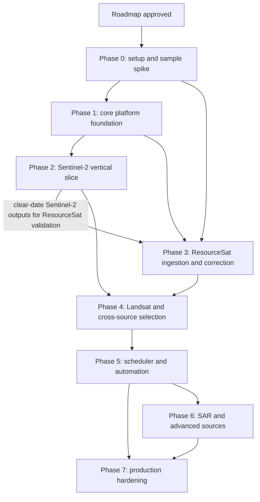

# Akasha Ingestion Implementation Roadmap

## 1. Purpose

This roadmap converts the high-level ingestion plan and architecture stack decisions into a sequential implementation path. It defines what to build first, what each phase depends on, what each phase must deliver, and what must be true before moving to the next phase.

Source documents:

- `docs/akasha-ingestion-plan.md`
- `docs/architecture-technical-stack.md`
- `docs/reference/satellite-catalog.md`

The roadmap is intentionally ordered by dependency, not by calendar date. Dates should be added only after Phase 0 confirms provider access, sample product characteristics, data size, and infrastructure capacity.

## 2. Recommended sequence

The recommended next step is **not Phase 1 yet**. Start with Phase 0 because it validates the real-world assumptions that Phase 1 depends on.

```text
Architecture docs complete
  -> Implementation roadmap
  -> Phase 0: setup, access, AOI, sample-product spike
  -> Phase 1: platform foundation
  -> Phase 2: Sentinel-2 vertical slice
  -> Phase 3: ResourceSat parallel track
  -> Phase 4: Landsat and cross-source analytics
  -> Phase 5: scheduler, automation, retention
  -> Phase 6: SAR and advanced sources
  -> Phase 7: production hardening
```

## 3. Roadmap principles

1. **Do not build provider-specific assumptions before sample products are inspected.**
2. **Prove the full pipeline with Sentinel-2 first** because Sentinel-2 L2A includes surface reflectance and SCL cloud masking.
3. **Build ResourceSat in parallel only after Phase 0 sample analysis** because atmospheric correction and custom cloud masking are the highest scientific risks.
4. **Keep every source gated** until provider access, processing, validation, license, and product exposure checks pass.
5. **Retain original provider raw packages by default** as the durable raw zone of the on-prem ingestion lake; raw cleanup is opt-in only.
6. **Inventory all available provider assets/bands**, then let processing profiles choose the subset required for each derived product.
7. **Store per-scene COGs, not permanent per-field rasters.**
8. **Use deterministic best-scene selection** for field queries.
9. **Treat the source catalogue as the source of truth** for source IDs, provider adapters, schedule state, exposure state, capability metadata, and execution-policy references.
10. **Enforce provider-specific execution policies** for rate limits, quotas, retries, staging, download concurrency, and backpressure.
11. **Keep Azure dev and on-prem production deployment equivalent** by using the same Docker Compose topology and pinned container images.
12. **Add observability, backups, and restore testing early**, not after data is already valuable.
13. **Make every phase exit-gated** so partial work does not appear production-ready.
14. **Keep Phases 2 to 6 on private/dev networks unless Phase 7 hardening is complete.** MVP API-key auth is acceptable for development, but public production exposure requires the Phase 7 security gates.

## 4. Dependency map



## 5. Workstreams

Use these workstreams across phases so planning and execution remain organized.

| Workstream                   | Responsibility                                                                                                |
| ---------------------------- | ------------------------------------------------------------------------------------------------------------- |
| Infrastructure               | Azure VM, on-prem VM, Docker, networking, storage, backups, deployment.                                       |
| Platform services            | FastAPI, PostGIS/pgSTAC, MinIO, Celery, Redis/RabbitMQ, TiTiler, scheduler.                                   |
| Provider integrations        | CDSE, Bhoonidhi/NRSC, USGS, Earthdata, future vendor adapters.                                                |
| Provider execution           | Provider-specific rate limits, quotas, retries, staging, token-bucket/backpressure, and queue routing.        |
| Raster processing            | all-band inventory, extraction, metadata parsing, CRS, resampling, AC, masking, index engine, COG generation. |
| Metadata and catalog         | source registry, scene catalog, orders, jobs, raw/extracted/ARD/derived assets, raster outputs, provenance.   |
| API and serving              | source API, sync API, jobs API, field index API, time-series/progressive NDVI API, signed tile/stat URLs.     |
| Security and compliance      | API auth, rate limits, secrets, license/product exposure, audit logs.                                         |
| Observability and operations | metrics, logs, alerts, dashboards, failed-job visibility, runbooks.                                           |
| Validation and QA            | sample-product checks, golden raster tests, COG validation, cross-source validation.                          |
| Documentation                | runbooks, adapter contracts, source activation checklist, operator procedures.                                |

## 6. Phase -1: planning baseline

### Goal

Confirm the planning foundation before implementation starts.

### Current status

| Deliverable                                | Status        |
| ------------------------------------------ | ------------- |
| High-level ingestion plan                  | Complete      |
| Satellite catalogue                        | Complete      |
| Architecture and technology stack document | Complete      |
| Implementation roadmap                     | This document |

### Exit gate

Phase -1 is complete when:

1. The implementation roadmap is reviewed and accepted.
2. Open operational inputs are tracked.
3. Phase 0 owner and execution environment are known.

## 7. Phase 0: setup, access, and sample-product spike

### Goal

Validate the real products, provider access, infrastructure assumptions, and AOI details before building the platform foundation.

### Why this comes before Phase 1

Phase 1 schema, storage sizing, adapter contracts, and processing profiles depend on what the providers actually return. ResourceSat in particular may vary by product level, band packaging, masks, metadata fields, staging flow, and atmospheric-correction inputs.

### Entry gate

Phase 0 can start when:

1. The roadmap is accepted.
2. Azure VM access is available.
3. Current Bhoonidhi/NRSC credentials and whitelisting are confirmed.
4. Team has permission to validate CDSE, USGS/M2M, and Earthdata accounts.

### Sequential tasks

#### 0.1 Confirm AOI and demo window

Deliverables:

- Exact Bangalore AOI polygon or center+radius.
- CRS for stored AOI geometry.
- Demo date range.
- Clear-season candidate window for sample downloads.
- Minimum field sizes to test, including small-field cases.

Acceptance:

- AOI is stored as a GeoJSON/WKT artifact.
- AOI covers Bangalore plus the planned 60 km radius.
- At least three representative test field polygons are available.

#### 0.2 Provision Azure Linux development VM

Deliverables:

- Ubuntu Server LTS VM.
- Static public IP if required for provider whitelisting.
- SSH key-only access.
- Firewall rules.
- Docker Engine and Compose plugin.
- Mounted data and scratch disks.
- Basic monitoring exporters.
- Ansible inventory and bootstrap playbook, or temporary setup notes that must be converted to Ansible in Phase 1.

Acceptance:

- VM can run Docker Compose.
- VM has enough scratch/data disk for sample products.
- Provider egress works from the whitelisted IP.

#### 0.3 Confirm provider accounts and access flows

Providers:

| Provider       | Source         | Required validation                                                          |
| -------------- | -------------- | ---------------------------------------------------------------------------- |
| Bhoonidhi/NRSC | ResourceSat-2A | Login/API access, order/staging behavior, download links, expiry, checksums. |
| CDSE           | Sentinel-2     | Auth, catalogue search, L2A product access, download.                        |
| USGS/M2M       | Landsat 8/9    | Auth, search, Collection 2 Level 2 access, QA_PIXEL asset access.            |
| Earthdata      | MODIS later    | Auth only for future readiness; not MVP field analytics.                     |

Acceptance:

- Each MVP provider has a documented access method.
- Credentials are not stored in plaintext.
- Any whitelisting requirement is documented.

#### 0.4 Download sample products

Download 3 to 5 representative products per MVP source:

| Source             | Sample target                                                      |
| ------------------ | ------------------------------------------------------------------ |
| Sentinel-2 L2A     | Clear, partly cloudy, and edge-of-AOI scenes.                      |
| ResourceSat LISS-4 | Multiple scenes if needed to cover AOI; clear and cloudy examples. |
| ResourceSat LISS-3 | Clear and cloudy examples with SWIR.                               |
| ResourceSat AWiFS  | Regional/coarse sample for coverage and metadata.                  |
| Landsat 8/9 C2 L2  | Clear and cloudy examples with QA_PIXEL.                           |

Acceptance:

- Samples are stored under a temporary controlled sample area.
- Product IDs, dates, provider links, checksums, and sizes are recorded.
- Failed downloads have error details.

#### 0.5 Document real product characteristics

For every sample product, record:

- product ID
- source ID and instrument
- product level
- file structure
- archive format
- metadata files
- band filenames
- band resolution
- CRS
- scale and offset
- nodata values
- cloud/QA assets
- scene footprint
- file sizes
- provider checksum support
- download/staging behavior

Acceptance:

- A sample-product matrix exists.
- Any mismatch against the planning assumptions is explicitly listed.

#### 0.6 ResourceSat atmospheric-correction feasibility check

Deliverables:

- Determine whether ResourceSat samples are BOA/surface reflectance, TOA, radiance, or DN.
- Identify ancillary inputs required for 6S/Py6S.
- Decide what DOS interim can produce.
- Define validation comparison method against overlapping Sentinel-2 clear scenes.
- Propose initial tolerance thresholds for ResourceSat NDVI/SR validation.

Acceptance:

- ResourceSat can be classified as ready for BOA processing or requiring custom AC.
- If ancillary data is missing, the risk is escalated before Phase 1 processing profiles are finalized.

#### 0.7 Storage and compute sizing estimate

Use actual samples to estimate:

- raw product size per source
- extracted asset size
- ARD/intermediate size
- per-index COG size
- six-month Bangalore backfill size
- production raw-lake growth with raw cleanup disabled by default
- backup/cold-storage requirement for retained raw provider packages
- scratch disk requirement
- approximate CPU time per product

Acceptance:

- MVP and production storage estimates are updated using real sample data.
- Estimates assume original raw provider packages are retained unless an explicit lifecycle cleanup policy is later enabled.
- Any gap against current VM sizing is documented.

### Phase 0 exit gate

Phase 0 is complete only when:

1. AOI and demo window are confirmed.
2. Azure VM is ready and provider egress is validated.
3. MVP provider access paths are documented.
4. Sample products are downloaded or access blockers are recorded.
5. Product structure and metadata are documented.
6. ResourceSat AC feasibility is understood.
7. Storage and compute estimates are updated.
8. Phase 1 schema and service assumptions are confirmed or revised.

## 8. Phase 1: core platform foundation

### Goal

Build the self-hosted platform foundation before implementing satellite-specific vertical slices.

### Entry gate

Phase 1 can start when Phase 0 exits successfully.

### Sequential tasks

#### 1.1 Repository and application scaffold

Deliverables:

- Python project structure.
- Dependency management.
- FastAPI application shell.
- Worker application shell.
- Shared config module.
- Test framework.
- Lint/type-check commands if selected.

Acceptance:

- API container starts.
- Worker container starts.
- Basic tests run.

#### 1.2 Docker Compose foundation

Services:

- API
- scheduler
- workers
- Postgres/PostGIS/pgSTAC
- MinIO
- Redis
- TiTiler
- Caddy or Traefik
- Prometheus
- Grafana
- Loki
- Alertmanager
- Flower
- pgBackRest

Acceptance:

- All services start with health checks.
- Internal services are not publicly exposed.
- Persistent volumes are mounted.

#### 1.3 Configuration and secrets

Deliverables:

- Environment-specific config.
- SOPS + age or equivalent secret workflow.
- Secret references for providers.
- Redaction rules for logs.

Acceptance:

- App reads provider credential references without exposing secret values.
- Logs do not print credentials.

#### 1.4 Database schema and migrations

Deliverables:

- Alembic setup.
- Core tables:
  - satellite sources
  - source credentials
  - provider execution policies
  - AOI registry
  - provider scenes
  - provider orders
  - scene assets
  - processing jobs
  - raster outputs
  - tile layers
  - field queries
  - field time-series queries
  - progressive NDVI summaries
  - audit logs
- PostGIS indexes.
- pgSTAC setup if adopted, or an explicit architecture decision record if declined.

Acceptance:

- Migrations run from empty DB.
- Key constraints and indexes exist.
- Seed source registry can be loaded from configuration/catalogue.
- pgSTAC adopt/decline decision is made before schema freeze.

#### 1.5 Object storage setup

Deliverables:

- MinIO buckets/prefixes.
- Bucket policies.
- Lake-zone prefixes: raw, extracted, ARD, indices, QA, analytics, reports, mosaics, tmp.
- Lifecycle controls disabled by default for raw packages.
- Object path conventions.
- Storage service abstraction.

Acceptance:

- API/worker can write and read test objects.
- Raw bucket is not public.
- Raw provider packages can be written and retained with checksum/lineage metadata.
- Raw cleanup cannot run unless explicitly enabled in configuration.

#### 1.6 Job queue and scheduler foundation

Deliverables:

- Celery app.
- Redis broker.
- Queue definitions.
- Retry policies.
- Provider execution-policy loading.
- Provider/source-specific rate-limit enforcement.
- Search/download/heavy/UI queue separation.
- Backpressure rules so backfills do not starve routine sync or UI analytics.
- Processing job state in Postgres.
- Scheduler table or source schedule evaluation module.

Acceptance:

- Test task can be queued, executed, retried, and reflected in DB.
- Provider execution policies can throttle jobs and limit concurrency in tests.
- Flower shows worker state.

#### 1.7 API foundation

Initial endpoints:

```text
GET /health
GET /api/v1/sources
POST /api/v1/ingestion/sync
GET /api/v1/jobs/{jobId}
GET /api/v1/jobs
```

Acceptance:

- Endpoints use consistent response/error schema.
- Auth placeholder or MVP API key auth is wired.
- Job creation is idempotent.

#### 1.8 Observability foundation

Deliverables:

- Structured JSON logging.
- Prometheus metrics.
- Grafana dashboards.
- Loki log ingestion.
- Alertmanager baseline alerts.

Acceptance:

- Service health, queue depth, disk usage, job failure, and backup status are visible.

#### 1.9 Backup and restore foundation

Deliverables:

- pgBackRest configuration.
- MinIO backup or replication approach.
- Config/secrets backup process.
- Restore runbook.

Acceptance:

- A test restore is completed on dev or staging.
- Backup failure alert exists.

#### 1.10 CI, image build, and release baseline

Deliverables:

- CI pipeline for tests, lint/type checks if selected, and migration validation.
- Pinned base images for Python, GDAL, PROJ, and runtime services.
- Versioned image tags.
- Image registry decision.
- Build and deploy documentation.
- Ansible bootstrap refined from Phase 0 setup notes.

Acceptance:

- CI builds the API and worker images reproducibly.
- CI validates Alembic migrations against an empty database.
- Geospatial base images pin GDAL/PROJ versions.
- Azure dev can deploy from versioned image tags instead of ad hoc local builds.

### Phase 1 exit gate

Phase 1 is complete when:

1. Docker Compose platform runs on Azure dev VM.
2. Database migrations and source seed data are working.
3. MinIO storage is available and private.
4. Raw lake writes preserve original packages with checksum and lineage metadata.
5. Celery jobs execute and update DB state.
6. Provider execution policies and queue isolation are functional.
7. API health/source/job endpoints work.
8. TiTiler is reachable internally.
9. Secrets, logs, metrics, dashboards, alerts, and backups are functional.
10. Restore has been tested at least once.
11. CI builds pinned images and validates migrations.

## 9. Phase 2: Sentinel-2 vertical slice

### Goal

Prove the first complete end-to-end optical pipeline using Sentinel-2 L2A.

### Entry gate

Phase 2 can start when:

1. Phase 1 exits.
2. CDSE credentials are validated.
3. Sentinel-2 sample product layout is documented.

### Sequential tasks

#### 2.1 CDSE provider adapter

Deliverables:

- CDSE authentication.
- AOI/date search.
- Scene metadata normalization.
- Product download with checksum/resume where available.
- Provider execution-policy values for CDSE rate limits, retry/backoff, availability lag, and download concurrency.

Acceptance:

- Search returns Sentinel-2 L2A scenes for Bangalore AOI.
- Downloaded raw packages are registered in the raw lake with checksum and lineage.
- Adapter contract tests verify normalized scene fields required by the shared catalog.
- CDSE jobs respect configured rate/concurrency policy.

#### 2.2 Sentinel-2 metadata and band extraction

Deliverables:

- SAFE/product parser.
- All available SAFE assets/bands inventory.
- Band mapping for downstream processing profiles.
- SCL mask mapping.
- CRS and resolution parsing.
- Scale/offset handling.

Acceptance:

- All available assets are inventoried, and required bands for NDVI, MSAVI, NDMI, NDBI, NDRE, and RECI are detected correctly.

#### 2.3 Sentinel-2 preprocessing profile

Deliverables:

- L2A surface reflectance path.
- SCL cloud/shadow/no-data mask.
- AOI clipping.
- Resolution alignment rules.
- Valid pixel computation.

Acceptance:

- Clear and cloudy samples produce expected usable-pixel scores.

#### 2.4 Index engine MVP

Implement:

- NDVI
- MSAVI
- NDMI
- NDBI
- NDRE
- RECI

Acceptance:

- Unsupported combinations are rejected.
- Division-by-zero, nodata, masks, and scale are handled.
- Formula versions are recorded.
- Golden-input index tests produce expected values for representative pixels.

#### 2.5 COG generation and registration

Deliverables:

- Per-scene COG output for supported indices.
- COG validation.
- Raster output metadata.
- STAC/pgSTAC item/assets if adopted.

Acceptance:

- `rio cogeo validate` passes for generated COGs.
- Outputs are queryable by scene, index, date, and AOI.
- Golden raster/stat regression tests produce expected COG metadata and zonal statistics.

#### 2.6 TiTiler and field-index API

Deliverables:

- Opaque layer ID registry.
- Signed tile/stat URL generation.
- Field polygon clipping.
- Zonal statistics.
- Best-scene selection v1.
- `POST /api/v1/analytics/field-index`.

Acceptance:

- A field polygon returns tile URL, stats, source, date, resolution, cloud score, quality, and provenance.
- Internal MinIO paths are not exposed.
- `UNAVAILABLE` is returned when no valid scene exists.

#### 2.7 Sentinel-2 six-month backfill

Deliverables:

- Backfill job for Bangalore AOI.
- Duplicate detection.
- Failure dashboard.
- Backfill summary.

Acceptance:

- Six-month Sentinel-2 backfill completes or failures are categorized and retryable.

### Phase 2 exit gate

Phase 2 is complete when Sentinel-2 can run:

```text
CDSE search -> raw lake registration -> all-band inventory -> metadata -> SCL mask -> indices -> COG -> catalog -> TiTiler -> field stats API
```

for at least one real field polygon and the six-month backfill is operational.

## 10. Phase 3: ResourceSat ingestion and atmospheric correction

### Goal

Build the India-specific ResourceSat track while keeping outputs exposure-gated until correction and quality checks pass.

### Entry gate

Phase 3 can start when:

1. Phase 1 exits.
2. Phase 0 ResourceSat sample-product analysis is complete.
3. Bhoonidhi/NRSC access flow is known.

Phase 3 tasks 3.1 through 3.6 may run partly in parallel with Phase 2 after Phase 1. Task 3.7 cannot complete until Phase 2 has produced clear-date Sentinel-2 outputs over the ResourceSat AOI overlap.

### Sequential tasks

#### 3.1 Bhoonidhi provider adapter

Deliverables:

- Auth/session handling.
- AOI/date search.
- Order/staging state machine.
- Polling for staged products.
- Expiring download URL handling.
- Download resume and checksum validation.
- Bhoonidhi execution-policy values for request limits, polling cadence, download concurrency, retry/backoff, URL expiry, and quotas.

Acceptance:

- ResourceSat LISS-4, LISS-3, and AWiFS scenes can be discovered and downloaded.
- Adapter contract tests verify normalized scene fields required by the shared catalog.
- Order/staging states and failure categories from the architecture state machine are persisted in Postgres.
- Bhoonidhi jobs respect configured execution policy.

#### 3.2 Per-instrument source profiles

Profiles:

| Source ID                        | Key rules                                            |
| -------------------------------- | ---------------------------------------------------- |
| `resourcesat-2a-liss4-mx70-l2` | Green, Red, NIR only; no NDMI/NDBI/NDRE/RECI.        |
| `resourcesat-2a-liss3-boa`     | Green, Red, NIR, SWIR; no red-edge indices.          |
| `resourcesat-2a-awifs-boa`     | Coarse regional product; field suitability warnings. |

Acceptance:

- Band-aware index support is correct per instrument.

#### 3.3 ResourceSat preprocessing

Deliverables:

- Product parser.
- All available asset/band inventory.
- Band extraction for configured processing profiles.
- CRS validation.
- AOI clip.
- Multi-scene same-date coverage support for LISS-4.
- Resampling rules.

Acceptance:

- Bangalore AOI coverage gaps are detected.
- Same-date scene grouping is represented in metadata.

#### 3.4 Atmospheric correction

Deliverables:

- DOS interim profile.
- 6S/Py6S integration plan or implementation.
- Ancillary input loading.
- AC version metadata.

Acceptance:

- ResourceSat outputs remain internal until validation passes.
- Failed correction records explicit rejection reason.

#### 3.5 Custom cloud mask

Deliverables:

- Initial threshold/spatial heuristic mask.
- Cloud confidence metadata.
- Usable-pixel computation.
- QA preview output.

Acceptance:

- ResourceSat cloud mask is marked with confidence status.
- Operator can inspect QA previews.

#### 3.6 ResourceSat index outputs

Generate only supported indices:

- LISS-4: NDVI, MSAVI, SAVI, NDWI, GNDVI where configured.
- LISS-3: NDVI, MSAVI, NDMI, NDBI, SAVI, NDWI, GNDVI.
- AWiFS: NDVI, MSAVI, NDMI, NDBI, SAVI, NDWI, GNDVI.

Acceptance:

- No ResourceSat source produces NDRE or RECI.
- No LISS-4 source produces NDMI or NDBI.
- Golden-input ResourceSat index tests are added once the accepted correction/masking profile is established.

#### 3.7 Cross-validation against Sentinel-2

Precondition:

- Phase 2 has produced clear-date Sentinel-2 outputs over the ResourceSat AOI overlap.

Deliverables:

- Overlapping clear-date scene selection.
- Common AOI/field comparison.
- NDVI/SR difference metrics.
- Tolerance thresholds.
- Validation report.

Acceptance:

- ResourceSat product exposure remains disabled until validation passes.

#### 3.8 ResourceSat backfill

Deliverables:

- Six-month ResourceSat backfill for Bangalore AOI.
- Failure categories.
- Storage and runtime summary.

Acceptance:

- ResourceSat pipeline can run end to end internally.
- External exposure is enabled only after validation and license gates.

### Phase 3 exit gate

Phase 3 is complete when ResourceSat products are ingested, corrected, masked, indexed, cataloged, and either:

- validated and enabled for serving, or
- explicitly kept internal with documented validation blockers.

## 11. Phase 4: Landsat and cross-source analytics

### Goal

Add Landsat 8/9 and make cross-source best-scene selection deterministic across Sentinel-2, ResourceSat, and Landsat.

### Entry gate

Phase 4 can start when:

1. Phase 2 exits.
2. USGS/M2M access is validated.
3. ResourceSat status is at least internally processable or explicitly gated.

### Sequential tasks

#### 4.1 USGS adapter

Deliverables:

- USGS auth.
- Landsat 8/9 Collection 2 Level 2 search.
- Asset discovery/download.
- Metadata normalization.
- USGS execution-policy values for request limits, retries, download concurrency, and availability lag.

Acceptance:

- Landsat 8/9 scenes for Bangalore AOI are searchable and downloadable.
- Downloaded raw packages/assets are registered in the raw lake with checksum and lineage.
- Adapter contract tests verify normalized scene fields required by the shared catalog.

#### 4.2 Landsat processing profile

Deliverables:

- Surface reflectance scale/offset handling.
- QA_PIXEL cloud/shadow/cirrus mask.
- All available asset/band inventory and band mapping.
- Supported index outputs.
- COG generation.

Acceptance:

- Landsat outputs NDVI, MSAVI, NDMI, and NDBI where bands support them.
- Landsat does not output NDRE/RECI.

#### 4.3 Cross-source best-scene selection

Deliverables:

- Unified source priority config.
- Field-level usable-pixel scoring across sources.
- Resolution-aware ranking.
- Nearest-date tie-break.
- Same-date mosaic handling where needed.

Acceptance:

- Two identical requests produce the same selected scene.
- Selection reason is returned in API response.

#### 4.4 Time-series API

Deliverables:

```text
POST /api/v1/analytics/field-timeseries
```

Response includes:

- date
- source
- sensor/instrument
- index value
- quality
- cloud/usable pixels
- resolution
- harmonization flags
- profile/version metadata

Acceptance:

- Mixed-source time series clearly labels source and resolution.

#### 4.5 Progressive NDVI analytics

Deliverables:

```text
POST /api/v1/analytics/field-progressive-ndvi
```

Response includes:

- dated NDVI points across the six-month MVP window
- source, sensor, resolution, quality, and selected scene per point
- first valid value
- latest value
- min, max, mean
- latest-vs-first delta
- trend slope
- unavailable periods
- mixed-source harmonization flags
- display/threshold profile IDs

Acceptance:

- A selected Bangalore plot can return a six-month progressive NDVI summary without the UI knowing provider-specific product details.
- Missing/cloudy periods are explicit and not interpolated silently.

### Phase 4 exit gate

Phase 4 is complete when Landsat is integrated and field analytics can deterministically choose among Sentinel-2, ResourceSat, and Landsat for supported indices, including a progressive NDVI summary for the MVP six-month window.

## 12. Phase 5: scheduler, automation, and retention

### Goal

Move from manually triggered pipelines to routine automated ingestion, processing, opt-in lifecycle governance, and operator visibility.

### Entry gate

Phase 5 can start when Phases 2 to 4 are stable enough for routine sync.

### Sequential tasks

#### 5.1 Revisit-aware scheduler

Deliverables:

- Source cadence logic.
- Provider availability lag config.
- Per-source schedule state.
- New-scene detection.

Acceptance:

- Scheduler checks sources at appropriate cadence instead of one generic interval.

#### 5.2 Automated ingest and process

Deliverables:

- Auto-search.
- Auto-download.
- Auto-process.
- Auto-register outputs.
- Failed-job retry controls.

Acceptance:

- New eligible scenes become queryable without manual intervention.

#### 5.3 Provider quotas and backpressure

Deliverables:

- Provider rate limits.
- Concurrent download limits.
- Queue priority.
- Backfill throttling.
- Provider quota dashboards.
- Throttle/backoff metrics.

Acceptance:

- Backfill jobs do not starve field analytics or routine sync.
- Provider limits are enforced by policy rather than ad hoc adapter code.

#### 5.4 Raw lifecycle governance

Deliverables:

- Raw lifecycle policy configuration, disabled by default.
- Operator enablement flow for scoped cleanup by source/AOI/environment.
- Raw cleanup eligibility job that only runs when explicitly enabled.
- MinIO lifecycle policies that are not active for raw packages by default.
- Metadata retention checks.
- Audit log for deletion.

Acceptance:

- Original provider raw packages are retained by default.
- Raw data is deleted only when lifecycle cleanup is explicitly enabled and derived outputs, lineage, checksums, backup/re-download posture, and provenance are confirmed.

#### 5.5 Operator dashboard

Deliverables:

- Failed jobs view.
- Retry controls.
- Source status view.
- Storage usage view.
- Recent outputs view.

Acceptance:

- Operators can identify and retry failures without direct DB access.

### Phase 5 exit gate

Phase 5 is complete when routine ingestion, processing, monitoring, retry, provider backpressure, and opt-in lifecycle governance work for active MVP sources.

## 13. Phase 6: SAR and advanced sources

### Goal

Add SAR and non-MVP sources without compromising the optical index architecture.

### Entry gate

Phase 6 should start after MVP optical automation is stable.

### Sequential tasks

#### 6.1 SAR architecture spike

Deliverables:

- Sentinel-1/EOS-04 processing requirements.
- Backscatter preprocessing design.
- Speckle filtering decision.
- Terrain correction requirements.
- SAR output schema.

Acceptance:

- SAR is documented as separate from optical index outputs.

#### 6.2 Sentinel-1 pipeline

Deliverables:

- CDSE Sentinel-1 search/download.
- GRD preprocessing.
- VV/VH outputs.
- VV/VH ratio.
- SAR RVI where supported.

Acceptance:

- SAR outputs are labeled as SAR-derived indicators, not NDVI replacements.

#### 6.3 Future source enablement

Potential sources:

- EOS-04
- NISAR
- MODIS
- EOS-06
- PlanetScope
- Cartosat-3
- other gated commercial sources

Acceptance:

- Sources remain disabled or hidden until validation, cost, and license gates pass.

## 14. Phase 7: production hardening

### Goal

Prepare the platform for real on-prem production operation.

### Entry gate

Phase 7 can start when MVP ingestion and serving are stable on Azure dev or staging.

### Sequential tasks

#### 7.1 On-prem deployment readiness

Deliverables:

- Production VM provisioned.
- Static public IP available.
- Provider whitelisting completed.
- Storage and backup targets mounted.
- Raw-lake growth projection reviewed against production storage and backup capacity.
- Firewall and TLS configured.

Acceptance:

- Production Compose stack starts and passes health checks.

#### 7.2 Security hardening

Deliverables:

- API auth enforced.
- Rate limits enforced.
- Admin endpoints isolated.
- Secrets rotation process.
- Audit logging.
- License/product exposure review.

Acceptance:

- No unauthenticated external analytics or tile access.
- Raw buckets are not public.

#### 7.3 Load and reliability testing

Deliverables:

- Backfill load test.
- Field-query load test.
- Progressive NDVI/time-series query load test.
- Worker failure test.
- Provider failure simulation.
- Provider throttle/quota simulation.
- Disk pressure test.

Acceptance:

- System behavior under load and failure is documented.

#### 7.4 Backup and restore drill

Deliverables:

- PostgreSQL restore.
- MinIO/object restore.
- Raw package restore and lineage verification.
- Config restore.
- Runbook update.

Acceptance:

- A clean VM can be restored to a working platform state.

#### 7.5 Production runbook

Deliverables:

- Deployment procedure.
- Rollback procedure.
- Backup/restore procedure.
- Provider credential rotation.
- Provider execution-policy update procedure.
- Raw lifecycle governance procedure.
- Source activation checklist.
- Incident response checklist.

Acceptance:

- Operations can be performed without ad hoc knowledge.

### Phase 7 exit gate

Phase 7 is complete when the on-prem environment is deployed, secured, monitored, backed up, restorable, raw-lake capacity is governed, and provider-whitelisted.

## 15. Documentation deliverables by phase

| Phase   | Required docs                                                                                                                               |
| ------- | ------------------------------------------------------------------------------------------------------------------------------------------- |
| Phase 0 | AOI definition, provider access notes, sample-product matrix, raw-lake storage sizing, ResourceSat AC feasibility note.                     |
| Phase 1 | VM setup runbook, deployment runbook, schema notes, provider execution-policy notes, secret management notes, backup/restore runbook.       |
| Phase 2 | Sentinel-2 adapter notes, processing profile, field-index API examples, COG validation report.                                              |
| Phase 3 | Bhoonidhi adapter notes, ResourceSat instrument profiles, AC/mask validation report.                                                        |
| Phase 4 | Landsat processing profile, cross-source best-scene selection spec, time-series and progressive NDVI API examples.                          |
| Phase 5 | Scheduler operations, retry procedure, provider quota/backpressure procedure, raw lifecycle governance procedure, operator dashboard guide. |
| Phase 6 | SAR processing design, SAR output definitions, advanced source activation notes.                                                            |
| Phase 7 | Production runbook, security checklist, DR checklist, load-test report.                                                                     |

## 16. Open decisions and clarification items

These should be resolved or tracked before or during Phase 0.

| Item                                             | Needed by                      | Why it matters                                                                                    |
| ------------------------------------------------ | ------------------------------ | ------------------------------------------------------------------------------------------------- |
| Exact Bangalore AOI polygon                      | Phase 0                        | Provider search, storage sizing, and backfill scope.                                              |
| Clear-season demo window                         | Phase 0                        | Sample product selection and initial validation.                                                  |
| CDSE credentials                                 | Phase 2                        | Sentinel-2 vertical slice.                                                                        |
| USGS/M2M credentials                             | Phase 4                        | Landsat integration.                                                                              |
| Earthdata credentials                            | Later Phase 4/6                | MODIS/future context products.                                                                    |
| pgSTAC adopt/decline                             | Phase 1                        | Blocks schema design, TiTiler-PgSTAC integration, and catalog strategy.                           |
| CI/CD platform and image registry                | Phase 1                        | Needed for pinned builds, migration validation, and dev/prod parity.                              |
| ResourceSat ancillary data source                | Phase 3                        | 6S/Py6S feasibility.                                                                              |
| Initial ResourceSat validation tolerance         | Phase 3                        | Product exposure gate.                                                                            |
| ResourceSat/Sentinel-2 overlap validation window | Phase 3                        | Defines the clear dates and fields used for ResourceSat cross-validation.                         |
| Dev-network exposure policy                      | Phase 2                        | Clarifies that Phases 2 to 6 are private/dev unless Phase 7 hardening is complete.                |
| Production VM spec and static IP                 | Phase 7, but size in Phase 0   | On-prem deployment and provider whitelisting.                                                     |
| Expected users and query volume                  | Phase 1/7                      | API sizing, rate limits, and load testing.                                                        |
| Processed COG retention period                   | Phase 1/5                      | MinIO lifecycle and storage planning.                                                             |
| Raw lifecycle cleanup scope, if any              | Phase 5/7                      | Default is no raw cleanup; enabling cleanup affects governance, storage, and restore assumptions. |
| Provider execution-policy values                 | Phase 1 and each adapter phase | Needed to enforce request limits, throttling, quotas, retries, staging, and concurrency.          |
| Operator dashboard MVP scope                     | Phase 1/5                      | Whether to build minimal internal UI or rely on Flower/Grafana first.                             |

## 17. Recommended immediate next actions

1. Approve this roadmap.
2. Create a Phase 0 execution checklist or issue list.
3. Confirm the exact Bangalore AOI polygon.
4. Validate Azure VM access and whitelisted public IP.
5. Confirm provider credentials for Bhoonidhi/NRSC, CDSE, USGS/M2M, and Earthdata.
6. Download and document sample products.
7. Use Phase 0 findings to finalize Phase 1 technical backlog.

## 18. Definition of MVP complete

The MVP is complete when:

1. Azure dev/staging runs the full self-hosted Compose stack.
2. Sentinel-2 works end to end for Bangalore AOI:
   ```text
   search -> raw lake registration -> all-band inventory -> process -> COG -> catalog -> tile -> field stats
   ```
3. ResourceSat works end to end internally and is externally exposed only if validation passes.
4. Landsat is integrated for continuity and cross-source selection.
5. Original provider raw packages are retained by default with checksum and lineage.
6. Provider execution policies enforce rate limits, retries, quotas, staging, and concurrency.
7. Field-index API returns signed tile/stat URLs, statistics, quality, resolution, selected scene, and provenance.
8. Progressive NDVI/time-series API returns six-month selected-plot analytics with source and quality labels.
9. Unsupported source/index combinations are rejected.
10. Best-scene selection is deterministic within the configured date window.
11. Scheduler can ingest and process new scenes automatically.
12. Monitoring, logs, retries, backups, restore, and raw lifecycle governance are operational.
13. The same deployment model can move to on-prem production with provider IP whitelisting.
